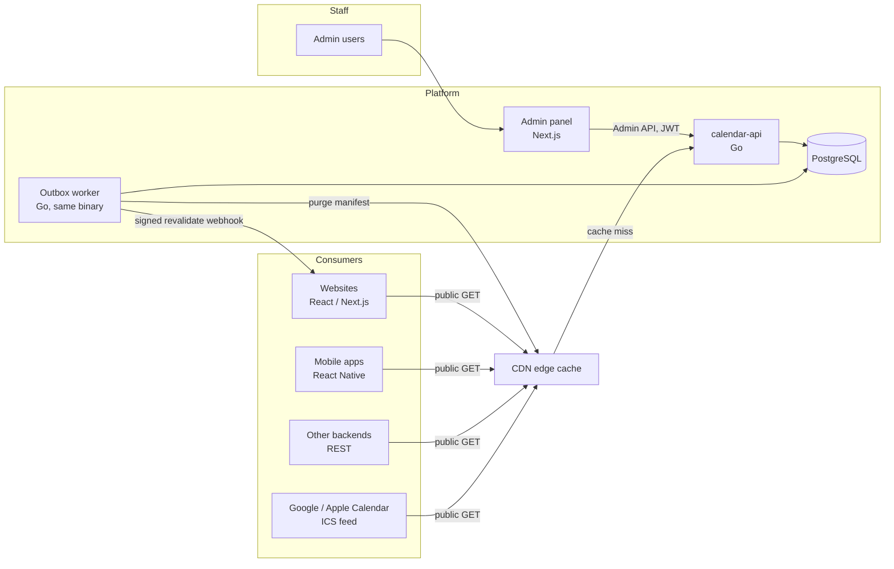

# BS/AD Calendar Platform — Architecture

> **Status:** v1 · **Last updated:** 2026-09-24
> **Implemented:** the Go service (`services/calendar-api`), the OpenAPI contract, Docker Compose and CI.
> **Clients:** call the API directly (docs/web.md, docs/react-native.md). **Planned:** an admin web UI (§12).
> **Related:** [api.md](api.md) (using and managing the API) · [flow.md](flow.md) (how things move) · [reliable.md](reliable.md) (how we keep it correct and available)

---

## 1. Purpose

An API-controlled calendar platform that gives every app and website in the organisation:

- A **date picker** that switches between **AD** (Gregorian) and **BS** (Bikram Sambat), with **light and dark** themes.
- An **event calendar** that shows public holidays, festivals and custom events.
- An **admin panel** where staff manage the BS year data, events, categories, and the look and behaviour of the calendar UI.
- **Copy-paste integrations** for **React Native** (Expo and bare) and **React / Next.js** that call the API directly.
- A **Go service** that is the single source of truth for all of the above.

## 2. Goals and non-goals

**Goals**

| # | Goal |
|---|------|
| G1 | Correct AD⇄BS conversion for every day in the supported range. |
| G2 | Apps stay usable on bad networks (cached months; optional fully offline mode, §10). |
| G3 | Admin changes (events, year data, theme) reach apps **without an app release**. |
| G4 | The same small client code on web and React Native. |
| G5 | Every admin action is validated, versioned, audited and reversible. |
| G6 | Runs anywhere with Docker; works with Next.js (including server rendering) and Expo Go. |

**Non-goals for v1**

- Tithi, nakshatra and other lunar/panchang data.
- Pushing new layouts or components from the server. Server-driven UI is limited to tokens and options (see §11).
- Personal user calendars, reminders, and private events.
- Dates outside the supported BS range (seeded: BS 1975–2100, AD 1918-04-13 to 2044-04-12).

## 3. Calendar facts that drive the design

| Fact | Design consequence |
|------|--------------------|
| BS month lengths (29–32 days) are **not computable by formula**. They are fixed each year by the official panchang committee. | Conversion is a **lookup table**, not maths. The table is data owned by the API and editable by admins. |
| Month lengths published for far-future years are **projections** and sometimes change. | Every year carries `status: verified \| projected`. Clients receive corrections through sync. |
| A BS month can have **32 days**. | BS dates can never be stored in SQL `date` or JS `Date`. Store them as `YYYY-MM-DD` text or `(y, m, d)` integers. |
| Major festivals (Dashain, Tihar, Chhath…) follow the **lunar** calendar. | They cannot be a recurrence rule. Admins enter them per year (with a "copy to next year" helper). |
| Nepal is **UTC+05:45** with **no DST**. The week starts **Sunday**; **Saturday** is the weekly holiday. | Defaults: `weekStart = 0`, `weekendDays = [6]`, `tz = Asia/Kathmandu`. "Nepal today" = UTC + 345 minutes, no `Intl` needed. |
| BS year ≈ AD year + 56 (Jan to mid-April) or + 57 (mid-April to Dec). | Year pickers and AD-mode month views can span two BS years. |

**BS months**

| # | English | Nepali |
|---|---------|--------|
| 1 | Baisakh | बैशाख |
| 2 | Jestha | जेठ |
| 3 | Asar | असार |
| 4 | Shrawan | साउन |
| 5 | Bhadra | भदौ |
| 6 | Ashwin | असोज |
| 7 | Kartik | कात्तिक |
| 8 | Mangsir | मंसिर |
| 9 | Poush | पुस |
| 10 | Magh | माघ |
| 11 | Falgun | फागुन |
| 12 | Chaitra | चैत |

Nepali digits: `० १ २ ३ ४ ५ ६ ७ ८ ९`.

## 4. Design principles

1. **The server owns the data; clients do the maths.** The API owns the year table, events and UI config. Clients convert dates locally with a cached copy of the table.
2. **Offline-first, stale-while-revalidate.** Render from cache (or the bundled snapshot) first, then refresh in the background.
3. **One internal date type: the epoch day number.** Every date is an integer count of days since 1970-01-01. AD and BS are only *views* of that number, so switching modes never loses the selection and never touches time zones.
4. **Contract-first.** `api/openapi.yaml` generates the Go server interfaces *and* the TypeScript client.
5. **Same algorithm, two languages, one fixture set.** The Go and TS engines pass the same golden file, and CI compares them for every day in range.
6. **Guardrails over freedom.** Admins control a validated set of tokens and options, not arbitrary code.
7. **Immutable, versioned resources.** Year data, UI config and event buckets are published as immutable versions behind a tiny manifest. That makes CDN caching safe and rollback trivial.

## 5. System overview



| Component | Responsibility |
|-----------|----------------|
| **calendar-api** (Go) | Source of truth. Public read API, admin API, validation, versioning, audit, ICS feed. |
| **Outbox worker** | Delivers webhooks and CDN purges reliably with retries. Runs from the same binary (`--worker`). |
| **PostgreSQL** | Year table, events, categories, UI configs, API clients, audit log, outbox. |
| **CDN** | Serves almost all public reads: immutable versioned URLs plus a short-TTL manifest. |
| **Web and mobile clients** | Call the public API with `fetch` (docs/web.md, docs/react-native.md). |
| **Admin panel** (planned) | A web UI over the admin API; until then use `/docs/try` or curl. |

## 6. Repository layout

A single monorepo. The Go module is at the root (`go.mod`, module `bscalendar`) so the service can
embed the shared `api/` and `fixtures/` files; the TypeScript workspace will sit beside it
(pnpm + Turborepo) and read the same files.

```
bs-calendar/
├─ go.mod · go.sum                 # Go module (root) — implemented
├─ api/
│  ├─ openapi.yaml                 # the API contract, embedded in the binary and served at /openapi.yaml
│  ├─ CHANGELOG.md · requests.http # API versions · VS Code REST Client walkthrough
│  └─ api.go                       # go:embed
├─ fixtures/
│  ├─ year-table.seed.json         # BS 1975–2100 with per-year provenance (Phase 0 output)
│  ├─ conversions.json             # golden AD⇄BS cases from independent sources
│  ├─ ui-config.schema.json        # JSON Schema for admin-controlled UI config
│  ├─ ui-config.default.json       # built-in config (served as version 0)
│  └─ fixtures.go                  # go:embed
├─ services/calendar-api/          # Go service (§7) — implemented
├─ deploy/postgres/                # database init scripts (test database)
├─ scripts/smoke.sh                # end-to-end smoke test that follows docs/api.md
├─ docker-compose.yml · Makefile · .env.example · redocly.yaml
├─ .github/workflows/ci.yml
├─ docs/                           # api.md, architecture.md, flow.md, reliable.md
└─ (no JavaScript packages: clients call the API directly, see docs/web.md and docs/react-native.md)
```

## 7. Go service

### 7.1 Stack

| Concern | Choice | Why |
|---------|--------|-----|
| Language | Go 1.26 | Single static binary, fast, strong stdlib HTTP and testing. |
| Router | stdlib `net/http.ServeMux` (method + wildcard patterns) | No dependency; `r.Pattern` gives route labels for metrics. |
| API contract | Hand-written `api/openapi.yaml` (OpenAPI 3.0.3), **enforced** by the flow test with `getkin/kin-openapi` | Every request and response in the flow test is validated against the spec, and uncovered operations fail the build. |
| Database | PostgreSQL 16 + `jackc/pgx/v5` | Arrays, JSONB, partial indexes, advisory locks, LISTEN/NOTIFY. |
| Queries | Hand-written SQL in each domain package (`sqlc` can be adopted later) | Explicit SQL; few enough queries that generation is not yet worth it. |
| Migrations | `pressly/goose/v3` (embedded, advisory-locked), run by `calendar-api bootstrap` | Safe to run on every deploy from several replicas. |
| JSON Schema | `santhosh-tekuri/jsonschema/v6` | Validates UI config with the same schema the clients use. |
| Recurrence | `teambition/rrule-go` | RFC 5545 RRULE for AD-based recurring events. |
| Admin auth | Email + password (bcrypt) → `golang-jwt/jwt/v5` HS256 access token + rotating refresh token | Works out of the box; OIDC login can be added in front of the same session model later. |
| Logging | `log/slog` (JSON) | Structured, stdlib. |
| Metrics | `prometheus/client_golang` on a separate port | Standard. OpenTelemetry tracing is planned. |
| Tests | stdlib `testing`, native fuzzing, `kin-openapi`; integration against the Compose Postgres | See [reliable.md](reliable.md) §5. |
| Lint | `gofmt`, `go vet`, `govulncheck`; Redocly for the spec; `oasdiff` for breaking changes | CI gates. |

### 7.2 Package layout

```
services/calendar-api/
├─ Dockerfile                # multi-stage → distroless, non-root, HEALTHCHECK via `calendar-api healthcheck`
├─ cmd/calendar-api/main.go  # serve | worker | bootstrap | migrate up|down|status | convert | dump | healthcheck | version
└─ internal/
   ├─ bscal/                 # PURE conversion engine. Imports nothing internal. No I/O.
   ├─ calendardata/          # live table (atomic pointer), snapshots, LISTEN/NOTIFY reload, four-eyes drafts
   ├─ events/                # categories, events, validation, recurrence, buckets, ICS, CSV import, copy-year
   ├─ uiconfig/              # schema + contrast validation, versions, channels (stable/candidate), rollback
   ├─ auth/                  # passwords, JWT, refresh rotation, API keys, RBAC, users, API clients
   ├─ audit/                 # append-only audit writer and reader
   ├─ outbox/                # transactional outbox, worker, webhooks (HMAC, AES-GCM secrets, SSRF guard)
   ├─ store/                 # pool, transactions, version counters, embedded goose migrations
   ├─ httpapi/               # routes, middleware, handlers, problem+json, metrics, docs; flow + contract test
   ├─ apperr/                # error type and stable codes → problem+json
   ├─ config/                # environment configuration (documented in .env.example)
   ├─ bootstrap/             # idempotent migrate + seed (tenant, year table, categories, admin, dev keys)
   └─ app/                   # wires everything; used by `serve` and by the tests
```

**Dependency rule:** `httpapi` → services (`calendardata`, `events`, `uiconfig`, `auth`, `outbox`) → `store`. `calendardata` uses `events` (to re-materialise event dates) and never the reverse; `events` sees the table only through a `TableSource` interface. `bscal` depends on nothing, so it is trivially testable and fuzzable.

### 7.3 Conversion engine (`internal/bscal`)

Dates are converted through an **epoch day number** using Howard Hinnant's integer calendar algorithms. No `time.Time`, no time zones.

```go
package bscal

import (
	"errors"
	"sort"
)

var (
	ErrOutOfRange  = errors.New("bscal: date outside supported range")
	ErrInvalidDate = errors.New("bscal: invalid date")
)

type Date struct{ Year, Month, Day int } // Month is 1..12

type Status uint8

const (
	Verified Status = iota
	Projected
)

type YearInfo struct {
	Year      int
	MonthDays [12]uint8
	StartDay  int64 // epoch day of 1 Baisakh
	Status    Status
}

// Table is immutable once built. Replace it atomically on publish.
type Table struct {
	Version int64
	years   []YearInfo // sorted, contiguous, validated by NewTable
}

// ToBS converts an AD (Gregorian) date to BS.
func (t *Table) ToBS(ad Date) (Date, error) {
	if !validGregorian(ad) {
		return Date{}, ErrInvalidDate
	}
	n := DaysFromCivil(ad.Year, ad.Month, ad.Day)
	i := sort.Search(len(t.years), func(i int) bool { return t.years[i].StartDay > n }) - 1
	if i < 0 {
		return Date{}, ErrOutOfRange
	}
	y := t.years[i]
	off := n - y.StartDay
	for m, md := range y.MonthDays {
		if off < int64(md) {
			return Date{y.Year, m + 1, int(off) + 1}, nil
		}
		off -= int64(md)
	}
	return Date{}, ErrOutOfRange // after the last day of the last year
}

// ToAD converts a BS date to AD (Gregorian).
func (t *Table) ToAD(bs Date) (Date, error) {
	y, ok := t.year(bs.Year)
	if !ok {
		return Date{}, ErrOutOfRange
	}
	if bs.Month < 1 || bs.Month > 12 || bs.Day < 1 || bs.Day > int(y.MonthDays[bs.Month-1]) {
		return Date{}, ErrInvalidDate
	}
	n := y.StartDay
	for m := 0; m < bs.Month-1; m++ {
		n += int64(y.MonthDays[m])
	}
	n += int64(bs.Day - 1)
	yy, mm, dd := CivilFromDays(n)
	return Date{yy, mm, dd}, nil
}

// DaysFromCivil is Hinnant's days_from_civil, valid for years >= 1.
func DaysFromCivil(y, m, d int) int64 {
	if m <= 2 {
		y--
	}
	era := y / 400
	yoe := y - era*400                     // [0, 399]
	doy := (153*((m+9)%12)+2)/5 + d - 1    // [0, 365]
	doe := yoe*365 + yoe/4 - yoe/100 + doy // [0, 146096]
	return int64(era*146097+doe) - 719468
}

// CivilFromDays is Hinnant's civil_from_days, valid for z >= -719468.
func CivilFromDays(z int64) (int, int, int) {
	z += 719468
	era := z / 146097
	doe := z - era*146097
	yoe := (doe - doe/1460 + doe/36524 - doe/146096) / 365
	y := yoe + era*400
	doy := doe - (365*yoe + yoe/4 - yoe/100)
	mp := (5*doy + 2) / 153
	d := doy - (153*mp+2)/5 + 1
	m := mp + 3
	if m > 12 {
		m -= 12
	}
	if m <= 2 {
		y++
	}
	return int(y), int(m), int(d)
}
```

`NewTable` rejects a table unless all invariants hold (the full list is in [reliable.md §3](reliable.md#3-correctness)):

- Years are contiguous, with no gaps or duplicates.
- Every month has 29–32 days.
- `StartDay(y+1) == StartDay(y) + sum(MonthDays(y))` for every consecutive pair.
- Every year is 365 or 366 days long (warning outside that, error outside 364–367).
- 1 Baisakh falls between 10 and 18 April.

**Checksum.** A snapshot's `sha256` is computed over a canonical text form, one line per year,
`<y>:<start>:<d1>,…,<d12>:<status>\n`. An earlier design hashed the JSON, but Postgres `jsonb`
reorders keys and clients in other languages cannot reproduce JSON bytes reliably. The text form is
checked end to end by the smoke test (it recomputes the checksum with `jq` and `sha256sum`).

An offline client would port this arithmetic line by line (using `Math.floor`, never `Date`); `calendar-api dump` prints every day for a parity check.

### 7.4 Year table service and hot reload

- The table is loaded at startup into an immutable `*bscal.Table` held in an `atomic.Pointer`.
- A year change goes through a **draft → approve** workflow with two different people. Approval runs in one transaction: validate the whole table, apply, bump the `data` version, re-materialise BS-based events, write audit and outbox rows, then `NOTIFY calendar_data`.
- Every replica `LISTEN`s on `calendar_data` and swaps its pointer. There is no restart and no lock on the read path. A one-minute poll is the backstop if a notification is missed.
- Every published version is kept in `calendar_data_versions`, so `/v1/calendar/data/{version}` stays downloadable forever.
- At startup the service retries the database for 60 seconds and then exits, so the orchestrator restarts it. Apps are unaffected meanwhile: they convert with their cached or bundled table.

### 7.5 Events

**Storage.** An event keeps its dates **in the calendar it was defined in** (`date_basis`, `start_local`, `end_local`). The service also materialises `ad_start/ad_end` and `bs_year_start/bs_year_end` for querying. When the year table changes, BS-based events are re-materialised in the same transaction.

**Recurrence rules**

| Rule | Meaning | Edge case handling |
|------|---------|--------------------|
| `none` | Single or multi-day event. | — |
| `yearly_bs` | Same BS month and day every year (e.g. Baisakh 1). | If the day doesn't exist that year (e.g. day 32), clamp to the last day of the month. |
| `yearly_ad` | Same AD month and day every year (e.g. 1 January). | 29 February falls on 28 February in non-leap years. |
| `rrule` | RFC 5545 RRULE, AD only (e.g. "every 2nd Friday"). | Expansion is capped per bucket (max 400 occurrences). |
| *Lunar festivals* | **Not a rule.** Entered per year. | The "copy to next year" tool creates drafts for an admin to correct. |

**Buckets.** Public event reads are served as **BS-year buckets**: all published events, with recurrences expanded, that touch that BS year. A bucket is small, immutable per version, and CDN-cacheable forever. Any AD or BS month view needs at most two buckets.

**Bucket versioning.** A bucket's version is the sum of four counters in `resource_versions`:

```
version(tenant, bsYear) = data + categories:<tenant> + events:<tenant>:recurring + events:<tenant>:y:<bsYear>
```

Each counter only ever grows, so the sum changes whenever any input changes and can never repeat.
A published one-off event bumps the year counters it touches (before and after an edit); any
recurring event bumps `recurring`, which moves every year at once; a category change bumps
`categories` (colours are inside buckets); a year-table change bumps `data`. The manifest lists
`eventBuckets` for years with their own counter plus a `defaultBucketVersion` for all others.
Drafts and archived events never bump anything, because clients cannot see them.

### 7.6 UI config

- The config is JSON validated against `fixtures/ui-config.schema.json`, embedded with `go:embed`. The same schema generates the TS types and the client-side Zod parser.
- **Contrast gate:** every text/background token pair must meet WCAG AA (4.5:1, or 3:1 for large text) in **both** light and dark palettes, or publishing is blocked.
- Versions are immutable. `ui_config_channels` holds, per app, a **stable** version and an optional **candidate** with a rollout percentage. **Publish** moves a pointer. **Rollback** re-publishes an older version's content under a new version number, so clients always move forward, and marks the version it replaced as `rolled_back` so it is never offered again, not even to older apps.
- `min_client_version` stops a config that uses new options from reaching old app builds. They keep the newest compatible version.
- Optional staged rollout: the manifest advertises `candidate: { version, percent }`. The client decides with `hash(installId) % 100 < percent`, so the manifest stays CDN-cacheable.

### 7.7 Middleware chain

```
Request ID + security headers → panic recovery → access log + metrics → CORS (preflight)
→ ServeMux route → auth (API key + origin allow-list, or JWT + live session check)
→ rate limit (token bucket per key / user / IP) → handler → ETag + Cache-Control, or problem+json
```

### 7.8 Configuration (environment)

Every variable, with development defaults, is documented in [`.env.example`](../.env.example).
The important ones:

| Variable | Purpose |
|----------|---------|
| `DATABASE_URL` | Postgres connection |
| `JWT_SIGNING_KEY` | HS256 key, at least 32 characters, from a secret manager |
| `WEBHOOK_SECRET_KEY` | Derives the AES-256-GCM key that encrypts webhook secrets at rest |
| `REQUIRE_API_KEY` | `true` in every shared environment |
| `CORS_ALLOWED_ORIGINS` | Preflight allow-list (keys add per-client origin checks) |
| `MIN_SUPPORTED_CLIENT` | Apps below this version get `updateRequired` |
| `CDN_PURGE_URL`, `CDN_PURGE_TOKEN` | Optional purge hook called by the worker |
| `ALLOW_PRIVATE_WEBHOOKS` | Development only: lets webhooks reach local addresses |
| `BOOTSTRAP_*` | First super admin and optional known development keys |

## 8. Data model

The source of truth is the migration
[`services/calendar-api/internal/store/migrations/00001_init.sql`](../services/calendar-api/internal/store/migrations/00001_init.sql).
Migrations are append-only: new changes go in new files.

| Table | Holds | Key rules |
|-------|-------|-----------|
| `tenants` | Organisations (one `default` tenant today) | Every tenant-owned row has `tenant_id`, so multi-tenancy needs no schema change. |
| `admin_users` | Admin accounts, role, bcrypt password hash, optional `oidc_sub` | Lower-case unique email; role is one of five. |
| `admin_sessions` | One row per login: current and previous refresh-token hash, expiry, revocation | Previous hash detects refresh-token reuse. |
| `calendar_years` | The current BS year table: month lengths, AD start, status, source | Months 29–32 (CHECK); unique AD start (deferred, so one draft can shift several years). |
| `calendar_data_versions` | Every published table snapshot with its checksum | Immutable; served at `/v1/calendar/data/{version}`. |
| `calendar_year_drafts` | Proposed changes, warnings, impact report, decision | CHECK: approver ≠ author. |
| `resource_versions` | Counters behind the manifest (`data`, `categories:<t>`, `events:<t>:recurring`, `events:<t>:y:<year>`) | Only ever incremented. |
| `categories` | Key, bilingual name, colours per theme, holiday flag, order | Unique key per tenant; hex colours (CHECK). |
| `events` | Dates in their basis calendar, materialised AD range and BS years, times, recurrence, status, version | Soft delete; optimistic-locking `version`; partial indexes for published and recurring rows. |
| `ui_configs` | Every config version with status, origin, `minClientVersion` | CHECK: approver ≠ author, except audited rollbacks. |
| `ui_config_channels` | Per app: stable version, candidate version and rollout percent | — |
| `api_clients` | Key prefix, SHA-256 of the key, kind, origins, rate limit | Keys are never stored in clear text. |
| `webhooks` | URL, topics, AES-GCM-encrypted signing secret | Topics limited to `events`, `categories`, `config`, `data`. |
| `outbox` | Pending webhook deliveries and CDN purges | Written in the same transaction as the change; lease-based claiming. |
| `audit_log` | Actor, IP, action, entity, before/after JSON, request id | Append-only (grant INSERT and SELECT only in production). |

BS dates are stored as `YYYY-MM-DD` text (`start_local`, `end_local`) because day 32 is not a valid SQL
`date`. The AD range and BS years are materialised for indexing and are recomputed in the same
transaction whenever the year table changes.

## 9. API design

The complete, enforced contract is [`api/openapi.yaml`](../api/openapi.yaml); how to use and evolve
it is in [api.md](api.md). This section summarises the shape.

### 9.1 Conventions

- JSON with `camelCase` fields. **Dates are always `"YYYY-MM-DD"` strings**, labelled with their calendar.
- Errors use `application/problem+json` (RFC 9457) with a stable `code` (22 codes, listed in api.md §8).
- Event `PATCH`/`DELETE` require `If-Match: "v<version>"`; missing → `428`, stale → `412 VERSION_CONFLICT`.
- `PATCH` bodies are JSON Merge Patch (RFC 7396). Request bodies reject unknown fields.
- Versioning: `/v1` is **additive only**. `oasdiff` in CI blocks breaking changes. A breaking change means `/v2`.
- Pagination: opaque `cursor` + `limit` (max 200).

### 9.2 Public endpoints (API key)

| Method & path | Purpose | Cache-Control |
|---------------|---------|---------------|
| `GET /v1/manifest?app=&clientVersion=` | Versions of data, config and event buckets. The only frequently changing resource. | `public, max-age=30, s-maxage=30, stale-while-revalidate=300` |
| `GET /v1/calendar/data/{version}` · `/latest` | Full year table · redirect to the current one | `immutable` · `no-store` |
| `GET /v1/ui-config/{app}/{version}` | UI config (version 0 = built-in default) | `immutable` (default: 1 hour) |
| `GET /v1/events/buckets/{bsYear}/{version}` | All published occurrences touching a BS year; old versions `302` to current | `immutable` |
| `GET /v1/events?from=&to=&basis=&category=&q=` | Range query for servers and search (≤ 366 days) | `max-age=60` |
| `GET /v1/events.ics?fromYear=&toYear=&category=&lang=` | ICS subscription feed (`?api_key=` allowed here) | `max-age=3600` |
| `GET /v1/categories` | Categories for legends | `max-age=60` |
| `GET /v1/convert?ad=` or `?bs=` | Single conversion | `max-age=3600` |
| `GET /v1/today?tz=` | Today in both calendars | `max-age=30` |
| `GET /v1/months/{basis}/{year}/{month}?weekStart=&weekendDays=&include=events` | 42-cell month grid | `max-age=300` |
| `POST /v1/telemetry` | Anonymous client health events | `no-store` |
| `GET /healthz` · `/readyz` · `/openapi.yaml` · `/docs` · `/docs/try` | Operations and documentation (no key) | — |

### 9.3 Example payloads

Manifest (abridged; real response from the local stack):

```json
{
  "dataVersion": 1,
  "dataSha256": "570c2c60d9792262…",
  "supportedRange": { "minBsYear": 1975, "maxBsYear": 2100, "minAd": "1918-04-13", "maxAd": "2044-04-12" },
  "currentBsYear": 2083,
  "firstProjectedBsYear": 2084,
  "config": { "app": "mobile", "version": 0, "minClientVersion": "0.0.0", "candidate": null },
  "eventBuckets": { "2083": 2 },
  "defaultBucketVersion": 1,
  "minSupportedClient": "0.0.0",
  "updateRequired": false,
  "links": { "data": "/v1/calendar/data/1", "config": "/v1/ui-config/mobile/0", "bucketTemplate": "/v1/events/buckets/{bsYear}/{version}" },
  "serverTime": "2026-09-24T17:48:01Z"
}
```

Occurrence (inside a bucket):

```json
{
  "id": "dec2e9e1-55bb-4d33-82df-6325c5010345",
  "eventId": "dec2e9e1-55bb-4d33-82df-6325c5010345",
  "title": { "en": "Office foundation day", "ne": "स्थापना दिवस" },
  "description": null,
  "category": "public_holiday",
  "isHoliday": true,
  "basis": "BS",
  "start": { "ad": "2026-10-06", "bs": "2083-06-20" },
  "end":   { "ad": "2026-10-06", "bs": "2083-06-20" },
  "allDay": true, "startTime": null, "endTime": null, "tz": "Asia/Kathmandu",
  "recurring": false,
  "color": { "light": "#B91C1C", "dark": "#F87171" },
  "version": 3,
  "updatedAt": "2026-09-24T17:48:11Z"
}
```

Recurring occurrences have ids like `<eventId>@<adDate>`.

### 9.4 Admin endpoints (`/v1/admin`, bearer token + RBAC)

| Area | Endpoints |
|------|-----------|
| Auth | `POST /auth/login` · `POST /auth/refresh` · `POST /auth/logout` · `GET /me` |
| Categories | `GET/POST /categories` · `PATCH/DELETE /categories/{id}` |
| Events | `GET/POST /events` · `GET/PATCH/DELETE /events/{id}` · `POST /events/{id}/publish` · `/archive` · `/restore` · `POST /events/import?dryRun=` (CSV) · `POST /events/copy-year` |
| Year table | `GET /years` · `GET/POST /years/drafts` · `GET /years/drafts/{id}` · `POST /years/drafts/{id}/approve` · `/reject` |
| UI config | `POST /ui-configs/validate` · `GET/POST /ui-configs/{app}` · `GET/PATCH /ui-configs/{app}/{version}` · `POST …/{version}/submit` · `/approve` · `/reject` · `POST /ui-configs/{app}/rollout` · `/rollback` |
| Platform | `GET/POST /api-clients` · `DELETE /api-clients/{id}` · `GET/POST /webhooks` · `DELETE /webhooks/{id}` · `GET /webhooks/{id}/deliveries` · `GET/POST /users` · `PATCH /users/{id}` · `GET /audit` · `GET /health/data` |

## 10. Clients (web and React Native)

Websites and apps call the public API directly with `fetch`; no SDK is required.

| Guide | Contents |
|-------|----------|
| [web.md](web.md) | Shared API client, React date picker and event calendar, admin-controlled theme with light/dark, Next.js server rendering and webhook refresh |
| [react-native.md](react-native.md) | The same client and hooks, a bottom-sheet date picker, native light/dark theme, refresh on foreground, offline cache |

The picker draws each month from `GET /v1/months/{AD|BS}/{year}/{month}?include=events`, whose 42 cells
already contain both dates, so clients never convert dates themselves.

**Optional, for fully offline apps:** download the year table (`/v1/calendar/data/latest`, about 10 KB),
verify its checksum, and convert on the device with the epoch-day arithmetic of §7.3. The manifest tells
the app when the table, config or events change. This path is designed (flow.md §2-3) but not packaged
as a library.

## 11. UI configuration and theming

### 11.1 Example config (schema v1)

```json
{
  "schemaVersion": 1,
  "defaults": {
    "mode": "BS",
    "locale": "ne",
    "digits": "devanagari",
    "weekStart": 0,
    "weekendDays": [6],
    "todayTimeZone": "device",
    "colorScheme": "system"
  },
  "display": {
    "allowModeSwitch": true,
    "showSecondaryDate": true,
    "showEventDots": true,
    "maxDotsPerDay": 3,
    "highlightHolidays": true,
    "showProjectedWarning": false,
    "views": ["month", "agenda"],
    "monthHeaderFormat": "MMMM YYYY"
  },
  "theme": {
    "light": {
      "bg": "#FFFFFF", "surface": "#F6F7F9", "text": "#111827", "muted": "#6B7280",
      "border": "#E5E7EB", "primary": "#1D4ED8", "onPrimary": "#FFFFFF",
      "today": "#1D4ED8", "holiday": "#B91C1C", "weekend": "#B91C1C", "disabled": "#9CA3AF"
    },
    "dark": {
      "bg": "#0B0F17", "surface": "#141A24", "text": "#F3F4F6", "muted": "#9CA3AF",
      "border": "#273041", "primary": "#60A5FA", "onPrimary": "#0B0F17",
      "today": "#60A5FA", "holiday": "#F87171", "weekend": "#F87171", "disabled": "#4B5563"
    }
  },
  "shape": { "radius": 12, "density": "comfortable" },
  "font": { "family": "system" }
}
```

### 11.2 Theme resolution order

1. The prop passed by the developer (`colorScheme="dark"`), highest priority.
2. The user's stored override, from a settings toggle.
3. The system scheme (`prefers-color-scheme` / `useColorScheme`).
4. `defaults.colorScheme` from the server config.
5. The built-in default theme, lowest priority.

Each field is parsed independently. An invalid or unknown value falls back to the level below instead of breaking the whole theme.

### 11.3 What admins can and cannot control

| Admins **can** control | Admins **cannot** control (needs a code release or Expo OTA update) |
|------------------------|---------------------------------------------------------------------|
| Colour tokens for light and dark | New components or layouts |
| Radius, density, font from an allowed list | Custom fonts not bundled in the app |
| Default mode, locale, digits, week start, weekend days | New interaction patterns |
| Secondary date, event dots, holiday highlight, available views | Anything not in the JSON Schema |
| Category colours and holiday flags | Behaviour of older app versions (gated by `min_client_version`) |

## 12. Admin panel

**Stack:** Next.js App Router, TanStack Query, react-hook-form + Zod, shadcn/ui, Monaco (JSON view), Auth.js with OIDC.

| Page | Key features |
|------|--------------|
| Dashboard | Data coverage, projected-year horizon, festivals missing for next BS year, recent changes, outbox health. |
| Year table | Year × month grid editor, live sum and invariant check, diff against published, impact report, source upload, approval queue. |
| Events | List and calendar views, AD/BS basis selector, bilingual fields, recurrence builder, bulk CSV/ICS import with dry run, copy to next year. |
| Categories | Names in English and Nepali, colours per theme with contrast check, holiday flag. |
| UI config | Form editor + JSON view, **side-by-side live preview** (web frame and phone frame, light and dark), validation, submit/approve/publish, rollout percentage, history and rollback. |
| API clients | Issue a key (shown once), allowed origins, rate limit, revoke. |
| Webhooks | Endpoints, topics, delivery log, redeliver. |
| Users & roles | Invite, change role, disable. |
| Audit log | Filter by actor, entity and date; before/after diff. |

**Role matrix**

| Action | viewer | editor | designer | calendar_admin | super_admin |
|--------|:-:|:-:|:-:|:-:|:-:|
| View everything | ✓ | ✓ | ✓ | ✓ | ✓ |
| Create, edit and publish events | | ✓ | | ✓ | ✓ |
| Manage categories | | | | ✓ | ✓ |
| Propose a year table change | | | | ✓ | ✓ |
| Approve a year table change (not their own) | | | | ✓ | ✓ |
| Draft a UI config | | | ✓ | | ✓ |
| Approve, publish or roll back a UI config (not their own) | | | ✓ | | ✓ |
| API clients, webhooks, users | | | | | ✓ |

## 13. Security

- **Public API keys** (`pk_…`) identify the app and enforce origin allow-lists and rate limits. They are **not secrets**, because they ship inside apps. Public endpoints serve only published, public data.
- **Server keys** (`sk_…`) are for backends and Next.js server components. They get higher limits and never reach browsers.
- Keys are stored as SHA-256 hashes. The full key is shown once.
- **Admin sign-in:** email and password (bcrypt, cost 12; timing-equalised for unknown users; 10 attempts per minute per IP). Access tokens are 15-minute HS256 JWTs. Refresh tokens rotate on every use, and reusing an old one revokes the session. Every admin request re-checks the session and user in the database, so logout, disabling and role changes apply immediately. OIDC (Google Workspace, Keycloak…) can be added in front of the same session model.
- **Authorization:** RBAC on every route; four-eyes approval enforced in code **and** by database CHECK constraints for year data and UI config.
- **Webhooks:** HMAC-SHA256 over `timestamp.body` with a 5-minute replay window; secrets encrypted at rest with AES-256-GCM; outbound connections to private, loopback and link-local addresses are refused (SSRF), unless `ALLOW_PRIVATE_WEBHOOKS` is set for development.
- **Input hardening:** strict JSON decoding (unknown fields rejected), body limits (1 MB, 10 MB for CSV), date range caps, RRULE frequency and expansion caps, bounded pagination.
- **Response hardening:** `X-Content-Type-Options: nosniff`, `Content-Security-Policy: default-src 'none'` on API responses, `X-Frame-Options: DENY`, `Referrer-Policy: no-referrer`, `Cache-Control: no-store` on errors and `private` on admin responses.
- **Data:** the audit log is append-only (grant INSERT and SELECT only). Secrets come from the environment or a secret manager. Terminate TLS at the load balancer; set `TRUST_PROXY=true` only behind it.
- **Supply chain:** `govulncheck` in CI; distroless, non-root runtime image.

## 14. Deployment

| Piece | Choice |
|-------|--------|
| Local | `docker compose up -d --build`: Postgres, one-shot `bootstrap`, `api`, `worker`; profiles for `smoke`, `webhook-sink` and `test`. |
| Container | Multi-stage build into `gcr.io/distroless/static-debian12:nonroot` with a built-in `HEALTHCHECK`. |
| Runtime | 2+ API replicas behind a load balancer (Docker Compose behind Caddy; see docs/deployment.md). Workers can scale out: rows are claimed with `FOR UPDATE SKIP LOCKED` and a 5-minute lease. |
| Database | Managed PostgreSQL with point-in-time recovery. |
| CDN | Cloudflare or similar in front of public `/v1/*` GETs; admin routes bypass it. Responses `Vary` on `X-Api-Key` and `Origin`. |
| Migrations | `calendar-api bootstrap` as a pre-deploy job (idempotent, advisory-locked), following expand → migrate → contract. |
| Environments | `dev` → `staging` (seeded copy) → `production`. CI runs the smoke test against a fresh stack. |
| Admin panel | Vercel or the same container platform (planned). |
| Packages | npm (public or private registry) via Changesets (planned). |

## 15. Technology decisions (summary)

| Decision | Chosen | Alternatives considered | Reason |
|----------|--------|-------------------------|--------|
| Where conversion runs | Server (month grids and conversions come from the API) | Client SDK with a bundled table | Simplest clients; an offline client remains possible (§10). |
| Cross-platform UI | One shared fetch client and two hooks; web and native components written per platform | A packaged component library | No packages to publish or version; native look on each platform. |
| Internal date type | Epoch day integer | JS `Date`, Luxon, dayjs | No time-zone bugs, simple maths, identical in Go and TS. |
| Sync model | Manifest + immutable versioned resources | Per-client delta feed, websockets | Near-total CDN hit rate, trivial rollback, simple clients. |
| Event distribution | BS-year buckets, version = sum of monotonic counters | Arbitrary range queries; per-year bumps to a horizon | Cacheable, small, predictable; no stale far-future buckets. |
| Contract | Hand-written OpenAPI enforced by a flow test | Code generation (oapi-codegen) | The test proves docs and behaviour match, including errors, without generated-code churn. |
| DB access | pgx with explicit SQL | sqlc, GORM, ent | Few queries; explicit SQL; sqlc can be added later without changing the schema. |
| Checksum | SHA-256 of a canonical text form | SHA-256 of JSON | JSON key order is not stable across Postgres `jsonb` and client languages. |
| Config validation | One JSON Schema for server and clients | Separate validators | One source of truth. |
| Side-effect delivery | Transactional outbox | Fire-and-forget calls | No lost webhooks or purges. |

## 16. Roadmap

| Phase | Deliverable | Status |
|-------|-------------|--------|
| 0 | Source and verify the year table; golden fixtures; OpenAPI; UI config schema | **Done**, except the official-calendar check of verified years (reliable.md §3.1) |
| 1 | `bscal` (Go) passing the fixtures | **Done** |
| 2 | Go public + admin API, Postgres, manifest and buckets, caching, ICS, webhooks, Compose, CI | **Done** |
| 3 | Web and React Native integration guides with a date picker, event calendar and theme | **Done** (docs/web.md, docs/react-native.md) |
| 4 | Production Docker deployment (Caddy HTTPS, least-privilege database, backups, zero-downtime updates) | **Done** (docs/deployment.md) |
| 5 | Admin panel UI on top of the existing admin API | Planned (3 weeks) |
| 6 | Load tests, OpenTelemetry, alert rules | Planned |

## 17. Open decisions

| # | Question | Current default |
|---|----------|-----------------|
| D1 | Who is the authoritative source for the year table, and who approves changes? | The official government calendar; two named calendar admins. **Needed before production.** |
| D2 | Single-tenant or multi-tenant? | Single `default` tenant; `tenant_id` is already on every tenant-owned table. |
| D3 | Supported BS range? | BS 1975–2100, as seeded (2084 onward projected). |
| D4 | Tithi/lunar data in v1? | No. It roughly doubles the data work. |
| D5 | Is "today" the device date or the Nepal date? | Device date, configurable per app (`todayTimeZone`). The API's `isToday` uses Nepal. |
| D6 | Public npm or private registry? | Private registry. |
| D7 | OIDC for admins? | Password login now; add OIDC when an identity provider is chosen. |
