# BS/AD Calendar Platform — Flows

> **Status:** v1. Server-side flows (sections 3, 4, 8, 9, 10, 12, 13, 14, 16) are implemented; client-side flows describe the planned TypeScript packages. · **Last updated:** 2026-09-25
> **Related:** [api.md](api.md) (the same flows as runnable commands) · [architecture.md](architecture.md) (components and data model) · [reliable.md](reliable.md) (failure handling and tests)

This document shows **how data and actions move** through the system. Diagrams use Mermaid, which renders on GitHub, GitLab and in VS Code with a Mermaid extension.

**Contents**

1. [System context](#1-system-context)
2. [App start](#2-app-start)
3. [Sync engine](#3-sync-engine)
4. [Date conversion](#4-date-conversion)
5. [Date picker interaction](#5-date-picker-interaction)
6. [Month grid and events rendering](#6-month-grid-and-events-rendering)
7. [Theme resolution](#7-theme-resolution)
8. [Event lifecycle (admin)](#8-event-lifecycle-admin)
9. [Year table correction](#9-year-table-correction)
10. [UI config publish, rollout and rollback](#10-ui-config-publish-rollout-and-rollback)
11. [Next.js rendering and revalidation](#11-nextjs-rendering-and-revalidation)
12. [Authentication](#12-authentication)
13. [Go request lifecycle](#13-go-request-lifecycle)
14. [Outbox delivery](#14-outbox-delivery)
15. [Offline and failure fallback](#15-offline-and-failure-fallback)
16. [CI/CD pipeline](#16-cicd-pipeline)
17. [Package release](#17-package-release)
18. [Yearly operations cycle](#18-yearly-operations-cycle)

---

## 1. System context

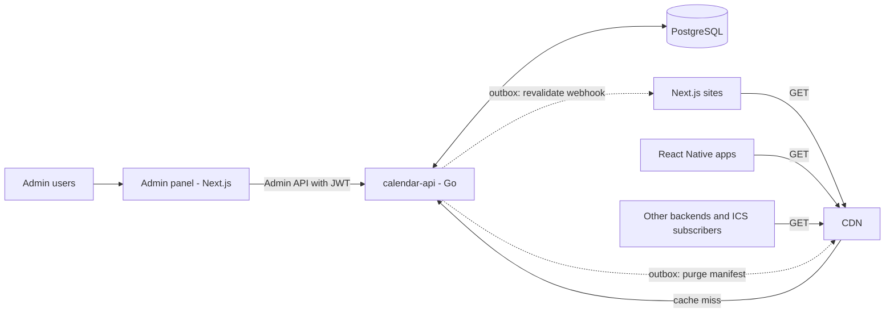
```mermaid
flowchart LR
  ADMIN["Admin users"] --> ADM["Admin panel - Next.js"]
  ADM -- "Admin API with JWT" --> API["calendar-api - Go"]
  API <--> DB[("PostgreSQL")]
  WEB["Next.js sites"] -- "GET" --> CDN["CDN"]
  APP["React Native apps"] -- "GET" --> CDN
  EXT["Other backends and ICS subscribers"] -- "GET" --> CDN
  CDN -- "cache miss" --> API
  API -. "outbox: revalidate webhook" .-> WEB
  API -. "outbox: purge manifest" .-> CDN
```

**Rule of thumb:** writes go only through the admin API. Reads go through the CDN. Clients never write.

## 2. App start

The picker renders **before** any network call. The network only ever *improves* what is already on screen.

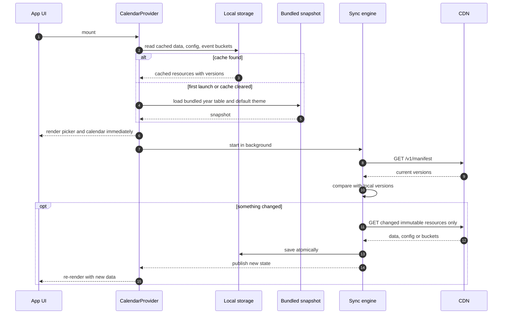
```mermaid
sequenceDiagram
  autonumber
  participant UI as App UI
  participant P as CalendarProvider
  participant S as Local storage
  participant B as Bundled snapshot
  participant SE as Sync engine
  participant CDN

  UI->>P: mount
  P->>S: read cached data, config, event buckets
  alt cache found
    S-->>P: cached resources with versions
  else first launch or cache cleared
    P->>B: load bundled year table and default theme
    B-->>P: snapshot
  end
  P-->>UI: render picker and calendar immediately
  P->>SE: start in background
  SE->>CDN: GET /v1/manifest
  CDN-->>SE: current versions
  SE->>SE: compare with local versions
  opt something changed
    SE->>CDN: GET changed immutable resources only
    CDN-->>SE: data, config or buckets
    SE->>S: save atomically
    SE-->>P: publish new state
    P-->>UI: re-render with new data
  end
```

**Key points**

- A cold start with no network still shows a fully working picker (bundled snapshot + default theme).
- A warm start shows the last known events and theme instantly.
- The new state is saved atomically: write the new resource, then update the pointer. A crash never leaves a half-written cache.

## 3. Sync engine

### 3.1 Triggers and throttling

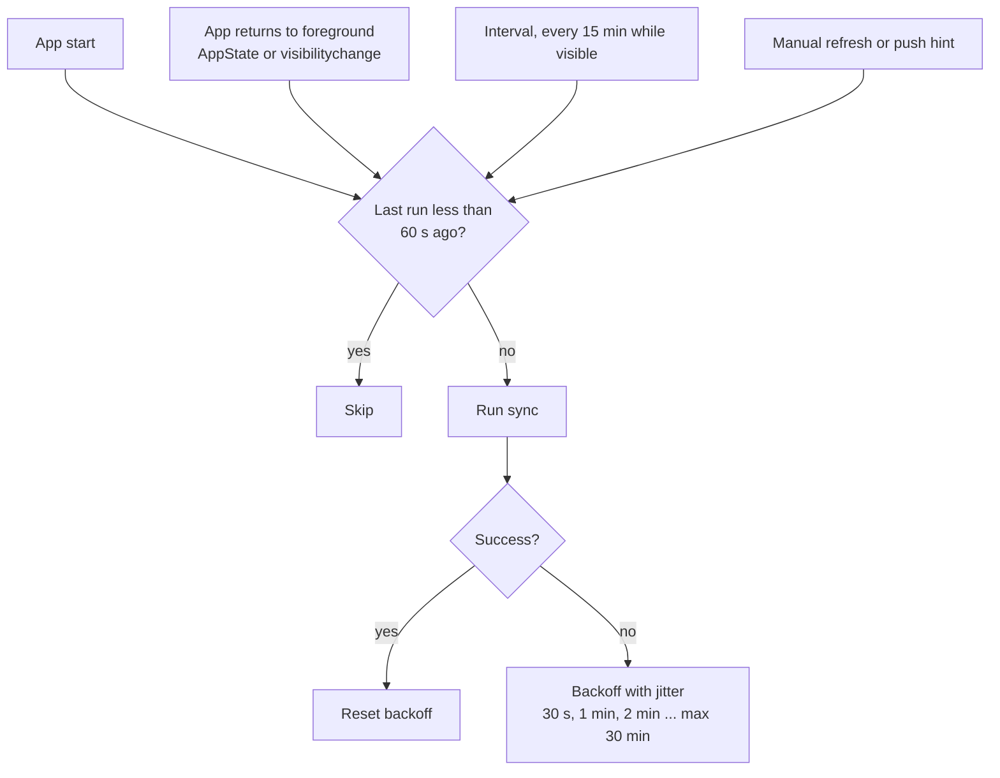
```mermaid
flowchart TD
  T1["App start"] --> Q
  T2["App returns to foreground<br/>AppState or visibilitychange"] --> Q
  T3["Interval, every 15 min while visible"] --> Q
  T4["Manual refresh or push hint"] --> Q
  Q{"Last run less than<br/>60 s ago?"} -- yes --> SKIP["Skip"]
  Q -- no --> RUN["Run sync"]
  RUN --> OK{"Success?"}
  OK -- yes --> RESET["Reset backoff"]
  OK -- no --> BO["Backoff with jitter<br/>30 s, 1 min, 2 min ... max 30 min"]
```

### 3.2 One sync run

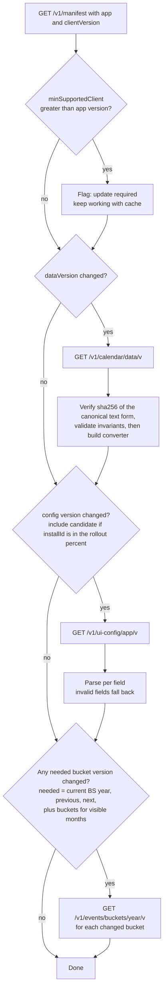
```mermaid
flowchart TD
  A["GET /v1/manifest with app and clientVersion"] --> B{"minSupportedClient<br/>greater than app version?"}
  B -- yes --> UPG["Flag: update required<br/>keep working with cache"]
  B -- no --> C{"dataVersion changed?"}
  UPG --> C
  C -- yes --> D["GET /v1/calendar/data/v"] --> D2["Verify sha256 of the canonical text form,<br/>validate invariants, then build converter"]
  C -- no --> E
  D2 --> E{"config version changed?<br/>include candidate if installId is in the rollout percent"}
  E -- yes --> F["GET /v1/ui-config/app/v"] --> F2["Parse per field<br/>invalid fields fall back"]
  E -- no --> G
  F2 --> G{"Any needed bucket version changed?<br/>needed = current BS year, previous, next,<br/>plus buckets for visible months"}
  G -- yes --> H["GET /v1/events/buckets/year/v<br/>for each changed bucket"]
  G -- no --> I["Done"]
  H --> I
```

**Why this design**

- The manifest is tiny and cached at the CDN for 30 seconds, so thousands of clients cost the origin roughly one request per 30 seconds.
- Every other URL contains its version, so it is cached forever and never needs a purge.
- Clients validate the year table with the same invariants as the server before swapping it in. A corrupt download is rejected and the old table stays.

## 4. Date conversion

Identical logic in Go (`internal/bscal`) and TypeScript (`bs-core`).

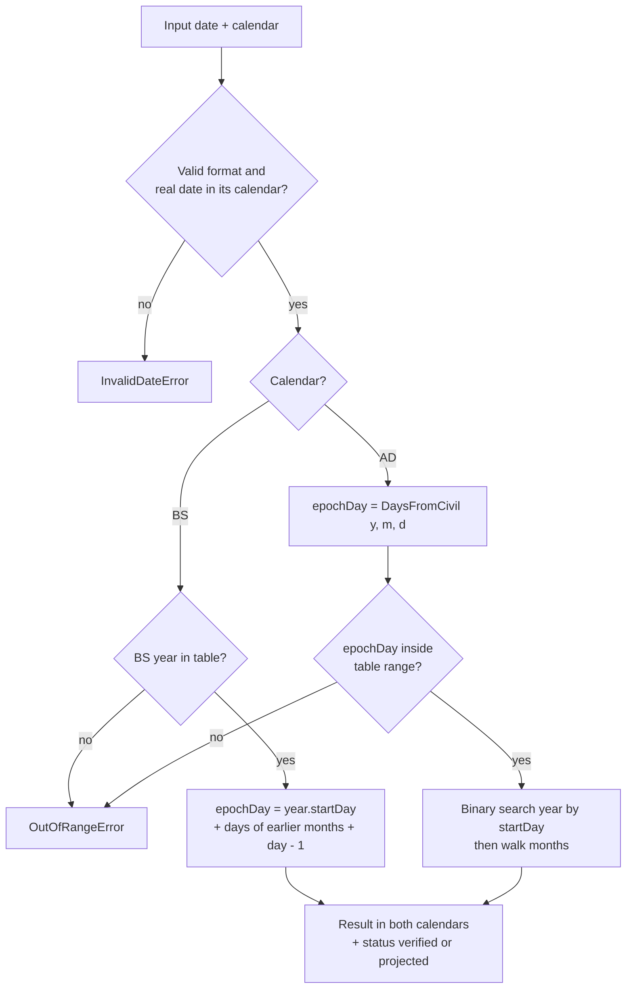
```mermaid
flowchart TD
  IN["Input date + calendar"] --> V{"Valid format and<br/>real date in its calendar?"}
  V -- no --> E1["InvalidDateError"]
  V -- yes --> K{"Calendar?"}
  K -- AD --> N1["epochDay = DaysFromCivil y, m, d"]
  K -- BS --> Y{"BS year in table?"}
  Y -- no --> E2["OutOfRangeError"]
  Y -- yes --> N2["epochDay = year.startDay<br/>+ days of earlier months + day - 1"]
  N1 --> R{"epochDay inside<br/>table range?"}
  N2 --> OUT
  R -- no --> E2
  R -- yes --> TB["Binary search year by startDay<br/>then walk months"]
  TB --> OUT["Result in both calendars<br/>+ status verified or projected"]
```

**Rules**

- Never convert through JS `Date` or Go `time.Time`. Only the epoch day integer.
- BS day 32 is valid only if that month has 32 days that year.
- Out-of-range is an explicit error, never a guess.

## 5. Date picker interaction

### 5.1 States

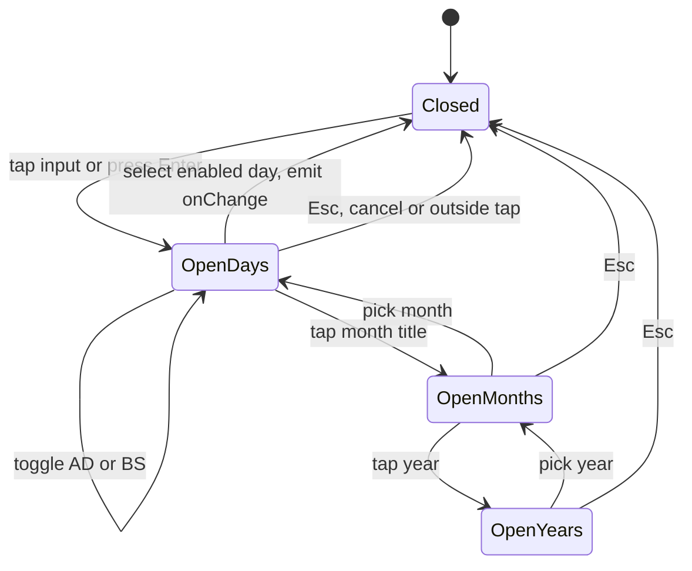
```mermaid
stateDiagram-v2
  [*] --> Closed
  Closed --> OpenDays: tap input or press Enter
  OpenDays --> OpenDays: prev or next month
  OpenDays --> OpenDays: toggle AD or BS
  OpenDays --> OpenMonths: tap month title
  OpenMonths --> OpenDays: pick month
  OpenMonths --> OpenYears: tap year
  OpenYears --> OpenMonths: pick year
  OpenDays --> Closed: select enabled day, emit onChange
  OpenDays --> Closed: Esc, cancel or outside tap
  OpenMonths --> Closed: Esc
  OpenYears --> Closed: Esc
```

### 5.2 Selecting a day

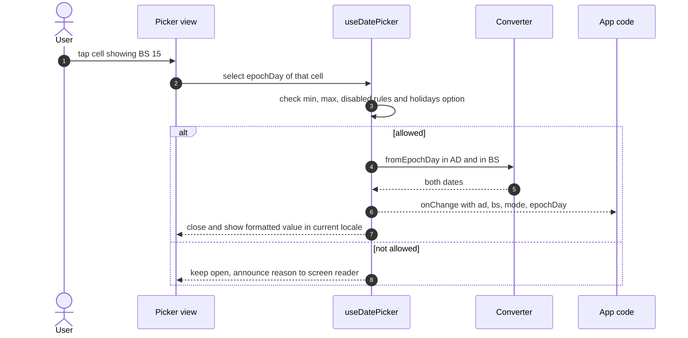
```mermaid
sequenceDiagram
  autonumber
  actor U as User
  participant V as Picker view
  participant H as useDatePicker
  participant C as Converter
  participant App as App code

  U->>V: tap cell showing BS 15
  V->>H: select epochDay of that cell
  H->>H: check min, max, disabled rules and holidays option
  alt allowed
    H->>C: fromEpochDay in AD and in BS
    C-->>H: both dates
    H-->>App: onChange with ad, bs, mode, epochDay
    H-->>V: close and show formatted value in current locale
  else not allowed
    H-->>V: keep open, announce reason to screen reader
  end
```

### 5.3 Switching AD and BS

Because the selection is stored as an **epoch day**, switching mode never changes the selected date.

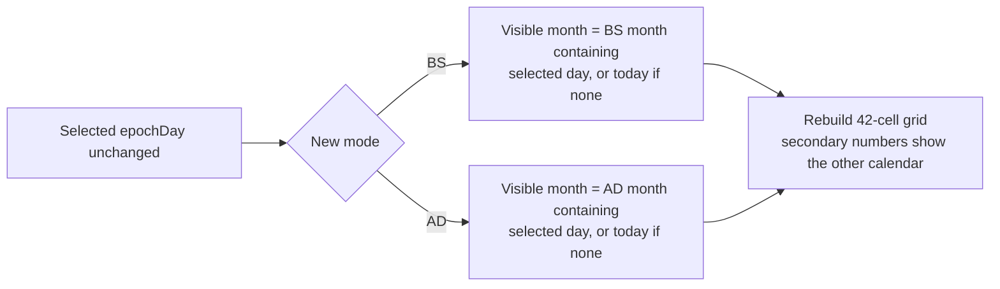
```mermaid
flowchart LR
  S["Selected epochDay unchanged"] --> M{"New mode"}
  M -- BS --> G1["Visible month = BS month containing<br/>selected day, or today if none"]
  M -- AD --> G2["Visible month = AD month containing<br/>selected day, or today if none"]
  G1 --> R["Rebuild 42-cell grid<br/>secondary numbers show the other calendar"]
  G2 --> R
```

### 5.4 Typing a date

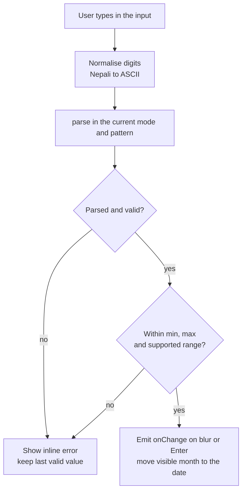
```mermaid
flowchart TD
  T["User types in the input"] --> D["Normalise digits<br/>Nepali to ASCII"]
  D --> P["parse in the current mode and pattern"]
  P --> OK{"Parsed and valid?"}
  OK -- no --> ERR["Show inline error<br/>keep last valid value"]
  OK -- yes --> RG{"Within min, max<br/>and supported range?"}
  RG -- no --> ERR
  RG -- yes --> EMIT["Emit onChange on blur or Enter<br/>move visible month to the date"]
```

## 6. Month grid and events rendering

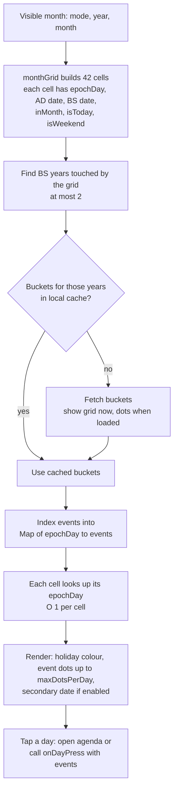
```mermaid
flowchart TD
  A["Visible month: mode, year, month"] --> B["monthGrid builds 42 cells<br/>each cell has epochDay, AD date, BS date,<br/>inMonth, isToday, isWeekend"]
  B --> C["Find BS years touched by the grid<br/>at most 2"]
  C --> D{"Buckets for those years<br/>in local cache?"}
  D -- yes --> E["Use cached buckets"]
  D -- no --> F["Fetch buckets<br/>show grid now, dots when loaded"]
  F --> E
  E --> G["Index events into<br/>Map of epochDay to events"]
  G --> H["Each cell looks up its epochDay<br/>O 1 per cell"]
  H --> I["Render: holiday colour, event dots up to maxDotsPerDay,<br/>secondary date if enabled"]
  I --> J["Tap a day: open agenda or<br/>call onDayPress with events"]
```

**Notes**

- Multi-day events are indexed on every day they cover.
- "Today" comes from `todayEpochDay(config.defaults.todayTimeZone)`. For `Asia/Kathmandu` it is computed as UTC + 345 minutes, which works even on engines with weak `Intl` support.

## 7. Theme resolution

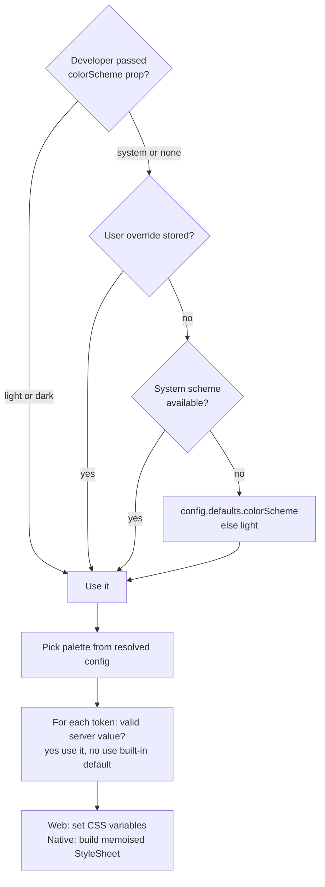
```mermaid
flowchart TD
  A{"Developer passed<br/>colorScheme prop?"} -- "light or dark" --> USE["Use it"]
  A -- "system or none" --> B{"User override stored?"}
  B -- yes --> USE
  B -- no --> C{"System scheme<br/>available?"}
  C -- yes --> USE
  C -- no --> D["config.defaults.colorScheme<br/>else light"] --> USE
  USE --> T["Pick palette from resolved config"]
  T --> F["For each token: valid server value?<br/>yes use it, no use built-in default"]
  F --> W["Web: set CSS variables<br/>Native: build memoised StyleSheet"]
```

On the web, a system-following theme is written as CSS with a `prefers-color-scheme` media query, so server-rendered HTML shows the right colours before JavaScript loads.

## 8. Event lifecycle (admin)

### 8.1 States

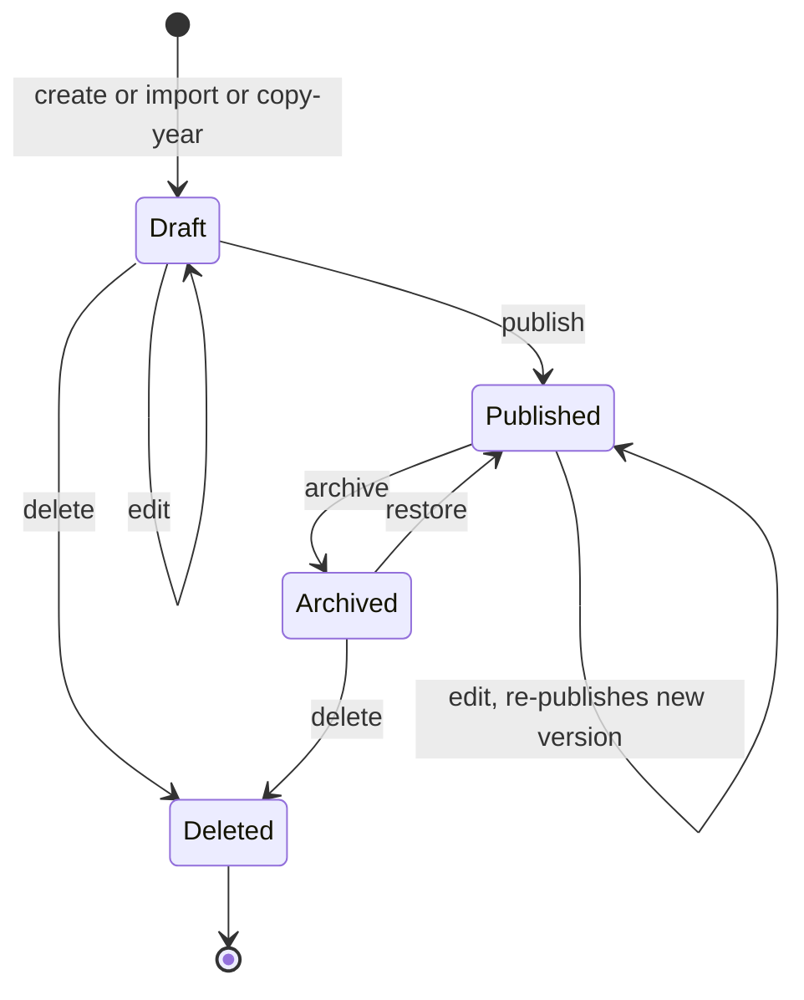
```mermaid
stateDiagram-v2
  [*] --> Draft: create or import or copy-year
  Draft --> Draft: edit
  Draft --> Published: publish
  Published --> Published: edit, re-publishes new version
  Published --> Archived: archive
  Archived --> Published: restore
  Draft --> Deleted: delete
  Archived --> Deleted: delete
  Deleted --> [*]
```

`Deleted` is a soft delete (`deleted_at`), recoverable by a super admin from the audit log.

### 8.2 Publish and propagation

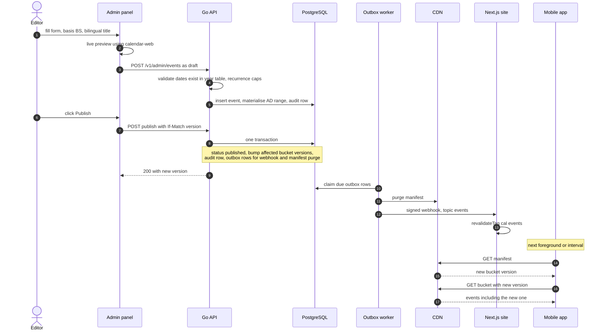
```mermaid
sequenceDiagram
  autonumber
  actor Ed as Editor
  participant ADM as Admin panel
  participant API as Go API
  participant DB as PostgreSQL
  participant W as Outbox worker
  participant CDN
  participant WEB as Next.js site
  participant APP as Mobile app

  Ed->>ADM: fill form, basis BS, bilingual title
  ADM->>ADM: live preview using calendar-web
  ADM->>API: POST /v1/admin/events as draft
  API->>API: validate dates exist in year table, recurrence caps
  API->>DB: insert event, materialise AD range, audit row
  Ed->>ADM: click Publish
  ADM->>API: POST publish with If-Match version
  API->>DB: one transaction
  Note over API,DB: status published, bump affected bucket versions,<br/>audit row, outbox rows for webhook and manifest purge
  API-->>ADM: 200 with new version
  W->>DB: claim due outbox rows
  W->>CDN: purge manifest
  W->>WEB: signed webhook, topic events
  WEB->>WEB: revalidateTag cal events
  Note over APP: next foreground or interval
  APP->>CDN: GET manifest
  CDN-->>APP: new bucket version
  APP->>CDN: GET bucket with new version
  CDN-->>APP: events including the new one
```

**Propagation times (targets)**

| Consumer | Time to see a published change |
|----------|--------------------------------|
| Next.js site with webhook | a few seconds |
| Next.js site without webhook | up to its `revalidate` window |
| Mobile app in foreground | up to 15 minutes, or on next foreground |
| Other backends via `/v1/events` | up to 60 seconds |

### 8.3 Bulk import

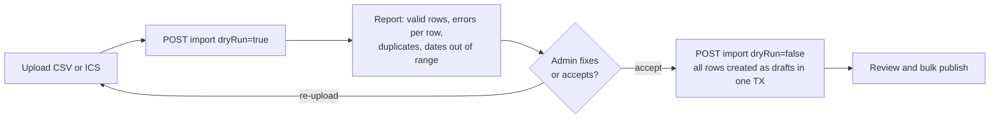
```mermaid
flowchart LR
  U["Upload CSV or ICS"] --> DR["POST import dryRun=true"]
  DR --> REP["Report: valid rows, errors per row,<br/>duplicates, dates out of range"]
  REP --> FIX{"Admin fixes<br/>or accepts?"}
  FIX -- "re-upload" --> U
  FIX -- accept --> IMP["POST import dryRun=false<br/>all rows created as drafts in one TX"]
  IMP --> REV["Review and bulk publish"]
```

## 9. Year table correction

The most sensitive flow, because it changes what every date means.

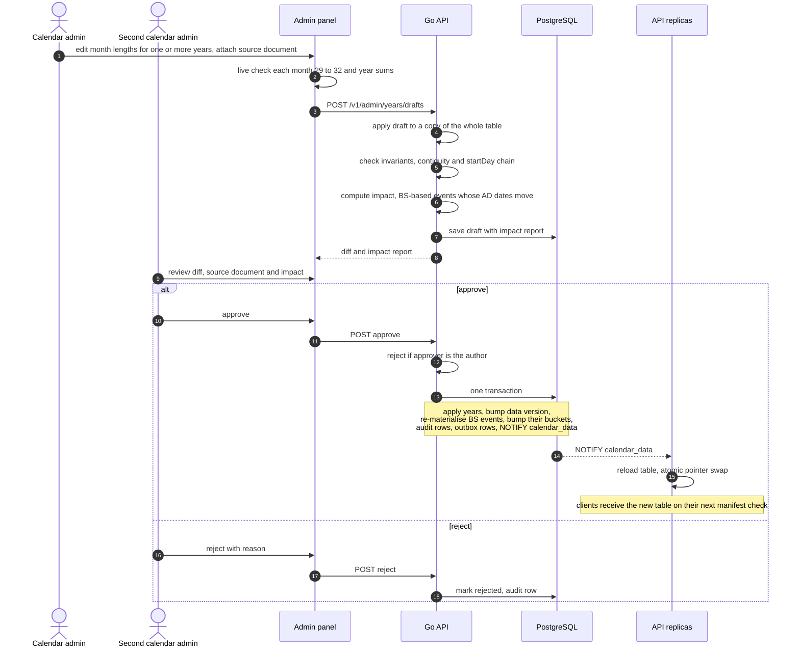
```mermaid
sequenceDiagram
  autonumber
  actor CA as Calendar admin
  actor AP as Second calendar admin
  participant ADM as Admin panel
  participant API as Go API
  participant DB as PostgreSQL
  participant R as API replicas

  CA->>ADM: edit month lengths for one or more years, attach source document
  ADM->>ADM: live check each month 29 to 32 and year sums
  ADM->>API: POST /v1/admin/years/drafts
  API->>API: apply draft to a copy of the whole table
  API->>API: check invariants, contiguity and startDay chain
  API->>API: compute impact, BS-based events whose AD dates move
  API->>DB: save draft with impact report
  API-->>ADM: diff and impact report
  AP->>ADM: review diff, source document and impact
  alt approve
    AP->>ADM: approve
    ADM->>API: POST approve
    API->>API: reject if approver is the author
    API->>DB: one transaction
    Note over API,DB: apply years, bump data version,<br/>re-materialise BS events, bump their buckets,<br/>audit rows, outbox rows, NOTIFY calendar_data
    DB-->>R: NOTIFY calendar_data
    R->>R: reload table, atomic pointer swap
    Note over R: clients receive the new table on their next manifest check
  else reject
    AP->>ADM: reject with reason
    ADM->>API: POST reject
    API->>DB: mark rejected, audit row
  end
```

**Invariant reminder:** changing a year's month lengths must keep its total days equal to the gap to the next year's 1 Baisakh. If the next year's start is also wrong, both years go in the same draft.

## 10. UI config publish, rollout and rollback

### 10.1 States

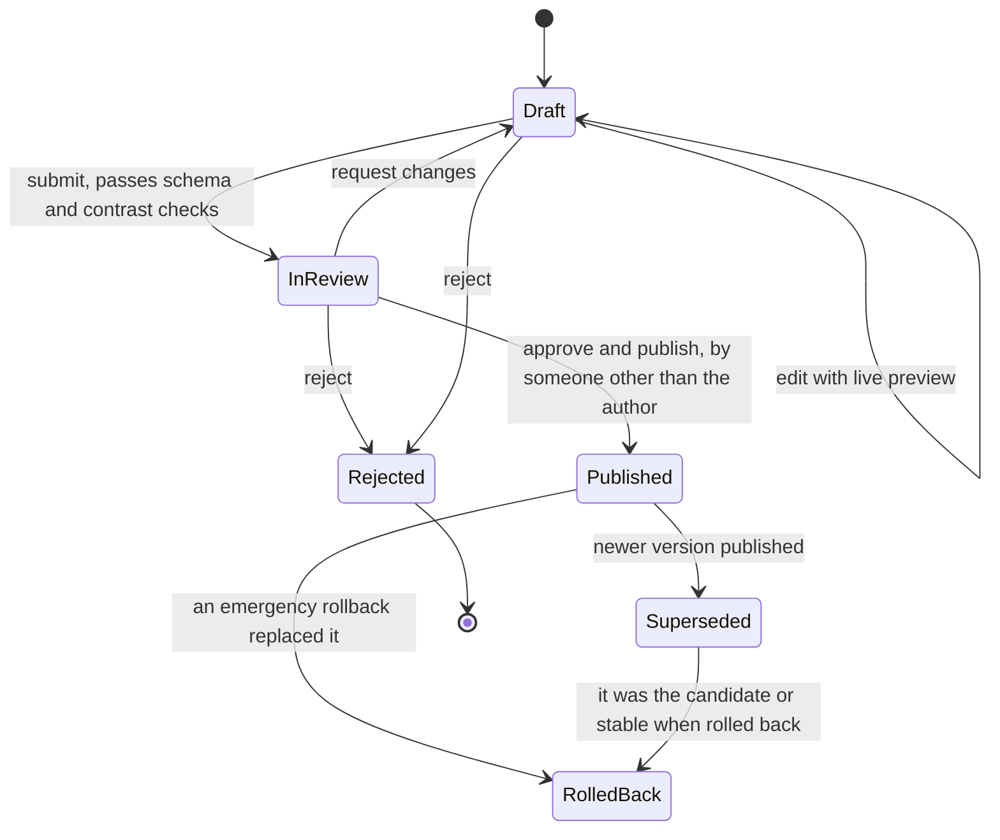
```mermaid
stateDiagram-v2
  [*] --> Draft
  Draft --> Draft: edit with live preview
  Draft --> InReview: submit, passes schema and contrast checks
  InReview --> Draft: request changes
  InReview --> Rejected: reject
  InReview --> Published: approve and publish, by someone other than the author
  Draft --> Rejected: reject
  Published --> Superseded: newer version published
  Published --> RolledBack: an emergency rollback replaced it
  Superseded --> RolledBack: it was the candidate or stable when rolled back
  Rejected --> [*]
```

A rollback never re-activates an old row. It **copies** the chosen version into a new version
(origin `rollback`) that becomes stable for everyone, and marks what it replaced as `rolled_back`,
which is never offered again, not even to older apps. Published URLs stay readable because they are immutable.

### 10.2 Staged rollout

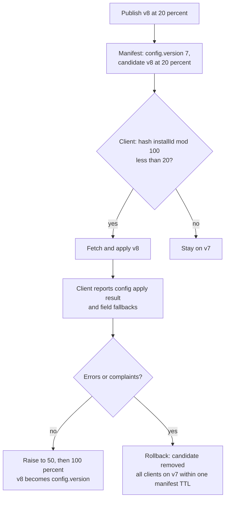
```mermaid
flowchart TD
  P["Publish v8 at 20 percent"] --> M["Manifest: config.version 7,<br/>candidate v8 at 20 percent"]
  M --> C{"Client: hash installId mod 100<br/>less than 20?"}
  C -- yes --> V8["Fetch and apply v8"]
  C -- no --> V7["Stay on v7"]
  V8 --> TEL["Client reports config apply result<br/>and field fallbacks"]
  TEL --> D{"Errors or complaints?"}
  D -- no --> UP["Raise to 50, then 100 percent<br/>v8 becomes config.version"]
  D -- yes --> RB["Rollback: candidate removed<br/>all clients on v7 within one manifest TTL"]
```

### 10.3 Client applying a config

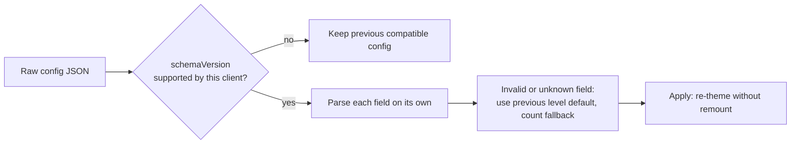
```mermaid
flowchart LR
  R["Raw config JSON"] --> SV{"schemaVersion<br/>supported by this client?"}
  SV -- no --> KEEP["Keep previous compatible config"]
  SV -- yes --> PF["Parse each field on its own"]
  PF --> FB["Invalid or unknown field:<br/>use previous level default, count fallback"]
  FB --> AP["Apply: re-theme without remount"]
```

## 11. Next.js rendering and revalidation

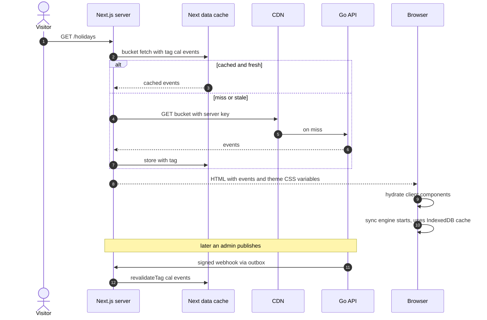
```mermaid
sequenceDiagram
  autonumber
  actor V as Visitor
  participant N as Next.js server
  participant DC as Next data cache
  participant CDN
  participant API as Go API
  participant Br as Browser

  V->>N: GET /holidays
  N->>DC: bucket fetch with tag cal events
  alt cached and fresh
    DC-->>N: cached events
  else miss or stale
    N->>CDN: GET bucket with server key
    CDN->>API: on miss
    API-->>N: events
    N->>DC: store with tag
  end
  N-->>Br: HTML with events and theme CSS variables
  Br->>Br: hydrate client components
  Br->>Br: sync engine starts, uses IndexedDB cache
  Note over N,API: later an admin publishes
  API->>N: signed webhook via outbox
  N->>DC: revalidateTag cal events
```

**SSR safety checklist**

- The provider reads storage only inside effects, never during render.
- The bundled snapshot is used for the server render, so the server and client produce identical markup.
- "Today" highlighting runs after hydration if the server and client could disagree around midnight.

## 12. Authentication

### 12.1 Admin login and session (implemented)

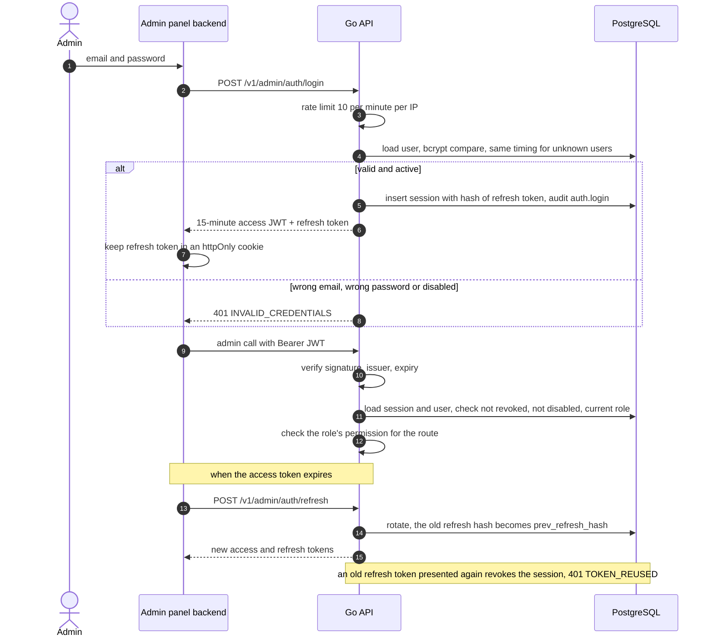
```mermaid
sequenceDiagram
  autonumber
  actor A as Admin
  participant ADM as Admin panel backend
  participant API as Go API
  participant DB as PostgreSQL

  A->>ADM: email and password
  ADM->>API: POST /v1/admin/auth/login
  API->>API: rate limit 10 per minute per IP
  API->>DB: load user, bcrypt compare, same timing for unknown users
  alt valid and active
    API->>DB: insert session with hash of refresh token, audit auth.login
    API-->>ADM: 15-minute access JWT + refresh token
    ADM->>ADM: keep refresh token in an httpOnly cookie
  else wrong email, wrong password or disabled
    API-->>ADM: 401 INVALID_CREDENTIALS
  end
  ADM->>API: admin call with Bearer JWT
  API->>API: verify signature, issuer, expiry
  API->>DB: load session and user, check not revoked, not disabled, current role
  API->>API: check the role's permission for the route
  Note over ADM,API: when the access token expires
  ADM->>API: POST /v1/admin/auth/refresh
  API->>DB: rotate, the old refresh hash becomes prev_refresh_hash
  API-->>ADM: new access and refresh tokens
  Note over API,DB: an old refresh token presented again revokes the session, 401 TOKEN_REUSED
```

OIDC (for example Google Workspace) can replace the password step later. It would create the same
session row, so everything after the first arrow stays unchanged.

### 12.2 Public API key

```mermaid
flowchart LR
  R["Request with X-Api-Key"] --> E{"Served by CDN cache?"}
  E -- yes --> OUT["Response, no origin cost"]
  E -- no --> H["Origin: sha256 of key, look up<br/>in-memory cache, then DB"]
  H --> V{"Active, origin allowed,<br/>under rate limit?"}
  V -- no --> X["401, 403 or 429"]
  V -- yes --> OUT2["Handle request"]
```

Public data is safe to serve from the CDN without re-checking the key on every hit. The key exists for identification, origin control and quotas, not secrecy.

## 13. Go request lifecycle

```mermaid
flowchart LR
  IN["Request"] --> RID["Request ID and<br/>security headers"] --> REC["Panic recover"] --> LOG["Access log<br/>and metrics"]
  LOG --> CORS["CORS preflight"] --> MUX["ServeMux route"] --> AUTH["API key and origin,<br/>or JWT and live session"]
  AUTH --> RL["Rate limit"] --> H["Handler"] --> SVC["Service layer"] --> ST["SQL via pgx,<br/>or in-memory table and bucket cache"]
  H --> OUT["JSON with ETag and Cache-Control,<br/>or problem+json"]
```

Conversion and bucket reads for the current version hit in-memory structures. Only cache misses and admin writes reach PostgreSQL.

## 14. Outbox delivery

```mermaid
flowchart TD
  TX["Admin write transaction<br/>also inserts outbox rows"] --> Q[("outbox table")]
  W["Worker loop every 1 s"] --> CL["Claim up to 20 due rows:<br/>UPDATE with FOR UPDATE SKIP LOCKED,<br/>attempts + 1, 5-minute lease"]
  Q --> CL
  CL --> SEND["Deliver: webhook signed with HMAC,<br/>or CDN purge"]
  SEND --> OK{"2xx within 10 s?"}
  OK -- yes --> DONE["Mark done_at"]
  OK -- no --> TRIES{"15 attempts reached?"}
  TRIES -- no --> RETRY["next_run_at = now + backoff<br/>30 s, 1 min, 2 min ... max 6 h"]
  TRIES -- yes --> DEAD["dead_at, error logged,<br/>outbox_dead metric alerts"]
```

A crashed worker's claimed rows become due again when the 5-minute lease expires, so nothing is lost.
Several workers can run at once.

A failed webhook never blocks or rolls back the admin action. Clients still converge through the manifest TTL.

## 15. Offline and failure fallback

```mermaid
flowchart TD
  S["Need calendar data"] --> C{"Local cache exists?"}
  C -- yes --> U["Render from cache now"]
  C -- no --> B["Render from bundled snapshot<br/>and default theme now"]
  U --> N
  B --> N{"Network and API OK?"}
  N -- yes --> F["Sync, update cache,<br/>re-render if changed"]
  N -- "no, timeout 5 s, or 5xx" --> K["Keep current state<br/>retry with backoff"]
  K --> STALE{"Cache older than 30 days?"}
  STALE -- yes --> HINT["Optional subtle hint:<br/>events may be out of date"]
  STALE -- no --> QUIET["No UI change"]
```

What keeps working with **no API at all**: the date picker, AD/BS conversion, month grids, theme, and all previously cached events. Only *new* admin changes wait.

## 16. CI/CD pipeline

**Implemented today** (`.github/workflows/ci.yml`):

```mermaid
flowchart LR
  PR["Pull request"] --> GO["go job: gofmt, go vet,<br/>unit tests, flow and contract test<br/>on a Postgres service, fuzz 30 s, govulncheck"]
  PR --> API["api-contract job: Redocly lint,<br/>oasdiff breaking vs base branch"]
  GO --> STACK["stack job: build the image,<br/>docker compose up,<br/>smoke test from docs/api.md"]
  STACK --> M["Merge to main"]
  API --> M
```

**Planned additions** as the TypeScript packages and deployments arrive:

```mermaid
flowchart LR
  U["TS unit and property tests<br/>vitest, jest"] --> PA["Parity job<br/>Go dump vs TS every day"]
  PA --> E2["E2E web and mobile<br/>Playwright, Maestro"]
  E2 --> VR["Visual regression<br/>light, dark, AD, BS, en, ne"]
  VR --> STG["Deploy staging<br/>bootstrap job first"]
  STG --> SM["Smoke test against staging"]
  SM --> PRD["Deploy production<br/>rolling, health-gated"]
  PRD --> WATCH["Watch error rate and latency<br/>auto-rollback on SLO breach"]
```

Planned nightly jobs: longer fuzzing, the full Maestro suite, k6 load tests against staging, and mutation testing of the conversion engines.

## 17. Package release

```mermaid
flowchart LR
  CH["Developer adds a changeset"] --> PR["PR merged"]
  PR --> VP["Changesets opens a Version PR<br/>bumps semver and changelogs"]
  VP --> REL["Version PR merged"]
  REL --> BUILD["Build ESM, CJS and types<br/>refresh bundled year snapshot"]
  BUILD --> PUB["npm publish with provenance"]
  PUB --> DEMO["Demo apps upgrade and run E2E"]
```

The bundled snapshot inside `bs-core` is refreshed from the production year table on every release. Apps built from older versions still receive newer data through sync.

## 18. Yearly operations cycle

The calendar data needs a small, predictable amount of human work each year. BS new year (1 Baisakh) falls in mid-April.

```mermaid
flowchart TD
  A["Official calendar for the next BS year published"] --> B["Calendar admin compares it with the table<br/>for that year"]
  B --> C{"Differences?"}
  C -- yes --> D["Year table correction flow, section 9"]
  C -- no --> E["Mark year as verified,<br/>attach source"]
  D --> E
  E --> F["Copy recurring and festival events to the new year<br/>as drafts"]
  F --> G["Enter lunar festival dates and public holidays<br/>from the official calendar"]
  G --> H["Second person reviews and publishes"]
  H --> I["Dashboard check: no missing major festivals,<br/>projected horizon still over 12 months away"]
```

Automated reminders (see [reliable.md §9](reliable.md#9-slos-and-alerts)) fire 90 days before a new BS year if it is still `projected` or has no public holidays entered.
