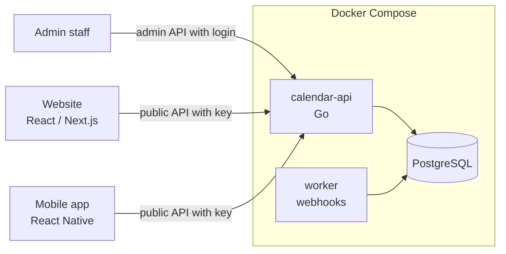

# How it works

A plain explanation of the BS/AD calendar service. For exact endpoints see [api.md](api.md); to use it
from apps see [web.md](web.md) and [react-native.md](react-native.md); to run it see [deployment.md](deployment.md).

## 1. The problem

Nepal uses two calendars: **AD** (Gregorian) and **BS** (Bikram Sambat). Converting between them is not
a formula. Each BS month has 29 to 32 days, and the lengths are decided every year by the official
calendar committee. So a converter needs a **table** of month lengths for every year, and that table must
be correctable when the official calendar is published.

That is why the calendar is **API-controlled**: one server owns the table, the events (holidays,
festivals) and even the look of the calendar. Apps and websites just ask the server.

## 2. The pieces

| Piece | What it does |
|-------|--------------|
| **calendar-api** | One Go program. Serves the public API (dates, events, theme) and the admin API (manage everything). |
| **worker** | Same program, other mode. Sends webhooks (for example "an event was published") with retries. |
| **PostgreSQL** | Stores the year table, events, UI settings, users, API keys and an audit log. |
| **bootstrap** | Runs once on every start: creates or updates the database tables and seeds the first data. |

## 3. The year table

The table covers **BS 1975 to 2100** (AD 1918-04-13 to 2044-04-12). Each year has its 12 month lengths,
the AD date of its first day (1 Baisakh) and a status:

- **verified**: the month lengths are confirmed.
- **projected**: a future estimate that may change when the official calendar is published.

The starting table came from three open-source tables compared year by year
(`fixtures/year-table.seed.json` records where each year came from). A calendar admin must still confirm
the verified years against the official calendar before production.

## 4. How a date is converted

Every date is turned into a single number: the count of days since 1970-01-01 (an "epoch day").

- **AD → number**: plain arithmetic.
- **BS → number**: the start of that BS year from the table, plus the lengths of the earlier months, plus the day.
- **number → BS**: find the year whose range contains the number, then walk through its months.

Because everything goes through a whole-day number, time zones can never shift a date by one day. The
engine is tested on every one of the 46,022 days in the table.

## 5. What the public API gives an app

All public calls need an API key in the `X-Api-Key` header.

| Need | Call |
|------|------|
| Convert one date | `GET /v1/convert?ad=2026-09-24` → BS 2083-06-08, month names, weekday (English and Nepali) |
| Today | `GET /v1/today` |
| A month to draw a picker or calendar | `GET /v1/months/BS/2083/6?include=events` → 42 day cells (6 weeks) with both dates, today, weekend, holiday flags and events |
| Events in a range | `GET /v1/events?from=2083-06-01&to=2083-06-31&basis=BS` |
| The admin-chosen look (colours, default AD/BS, language) | `GET /v1/manifest?app=web` → `links.config` → `GET /v1/ui-config/web/{version}` |
| Subscribe in Google or Apple Calendar | `GET /v1/events.ics?api_key=…` |

The simplest app just calls `/v1/months/...` for each month the user opens. That is what the web and
React Native guides show.

Apps that must work fully offline can instead download the whole year table once
(`GET /v1/calendar/data/latest`, about 10 KB) and convert on the device with the same arithmetic. The
**manifest** tells them when the table, the theme or the events changed, so they only re-download what is new.

## 6. How admins control everything

Admins sign in (`POST /v1/admin/auth/login`) and use the admin API. There is no admin web page yet; use
the API reference at `/docs/try` or the commands in [api.md](api.md).

| Task | How it works | Safety |
|------|-------------|--------|
| **Add a holiday or event** | Create it as a draft with dates in BS or AD, then publish it. | Dates are checked against the table. Editing needs the current version number, so two admins cannot overwrite each other. Every change is in the audit log. |
| **Recurring events** | Every year on the same BS date, the same AD date, or a rule such as "second Friday". | Lunar festivals (Dashain, Tihar) move every year, so they are entered per year; "copy to next year" makes drafts to review. |
| **Correct the year table** | Propose new month lengths with a source. A second calendar admin approves. | The server shows which events would move and refuses changes that break the table or leave events on dates that no longer exist. |
| **Change the calendar's look** | Draft new colours or defaults, submit, a second designer approves, optionally to a percentage of users first. | Colours must pass a contrast check for readability in light and dark mode. A one-click rollback restores an earlier version. |
| **Give an app access** | Issue an API key; optionally lock it to your website's address. | Keys are stored as hashes and shown once. |

When something is published, apps see it on their next request. Websites can also receive a signed
webhook to refresh immediately.

## 7. What keeps it reliable

- **Checked data.** The server validates the year table on every change. A second person must approve.
- **Tested code.** Every API response is checked against the documented contract (`api/openapi.yaml`) in the tests.
- **Safe production settings.** In production the server refuses to start with development passwords,
  plain-HTTP URLs or unsafe options.
- **No downtime on update.** New versions start, pass their health check, and the proxy holds requests
  during the switch.
- **Limited database rights.** The API uses a database user that cannot change tables or erase the audit log.

More detail: [reliable.md](reliable.md) and [architecture.md](architecture.md).
