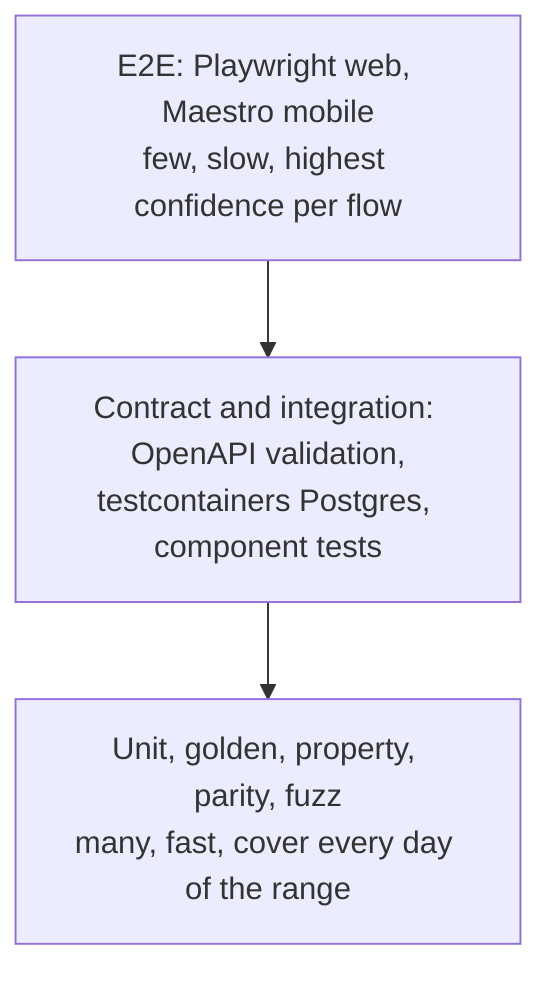

# BS/AD Calendar Platform — Reliability

> **Status:** v1. The Go service and its tests are implemented; client-side items describe the planned TypeScript packages. · **Last updated:** 2026-09-25
> **Related:** [api.md](api.md) (API guide) · [architecture.md](architecture.md) (components and data model) · [flow.md](flow.md) (how things move)

This document answers: **how much can we trust this system, and what keeps it that way?** It covers correctness, testing, availability, failure modes, SLOs, operations and known limits.

---

## 1. Summary

| Area | Expected reliability | Why | Main residual risk |
|------|----------------------|-----|--------------------|
| AD⇄BS conversion, **verified** years | **Very high** | Table lookup + integer maths, tested on every single day, identical in Go and TS. | A transcription error in the source data (mitigated by independent fixtures and four-eyes review). |
| AD⇄BS conversion, **projected** years | **Medium, fixable remotely** | Future month lengths are estimates until officially published. | A date near a month boundary can be off by one day until corrected. Corrections reach apps without a release. |
| Date picker and calendar availability | **Very high** | Offline-first: bundled snapshot + local cache. Never waits on the network. | None for core use. Only new admin changes are delayed during an outage. |
| Events and holidays | **As good as admin data** | Validation, preview in both calendars, review, audit, quick unpublish. | Human error in entering lunar festival dates. |
| Admin-controlled UI | **High with guardrails** | Schema, contrast gate, preview, approval, staged rollout, per-field fallback, one-click rollback. | A valid but ugly config reaching a rollout slice before rollback. |
| Public API | **99.9%+** | Immutable versioned URLs behind a CDN, stateless Go replicas. | CDN provider outage (clients keep working from cache). |
| Admin API | **99.5%** | Standard replicas + managed Postgres. | DB outage blocks writes (not reads). |

**Bottom line:** the architecture makes the *software* very reliable. The real risk is *data quality* (the BS year table and festival dates). That is why so many guardrails in this document target the data and the people who edit it.

## 2. What "reliable" means here

1. **Correct:** every date shown or returned is the right date in both calendars.
2. **Consistent:** server, web and mobile always agree for the same data version.
3. **Available:** the picker and calendar work even when the API, CDN or network does not.
4. **Safe to change:** admin and code changes can be previewed, staged and undone.
5. **Observable:** when something is wrong, we find out before users tell us.

## 3. Correctness

### 3.1 Sourcing the year table (Phase 0)

1. Take the primary source: the official calendar published through the government-recognised panchang committee.
2. Cross-check against **two independent secondary sources** (for example, two widely used existing converter libraries or calendar apps).
3. Any disagreement is investigated manually against the official printed calendar. The decision and its source are recorded in `calendar_years.source`.
4. Years confirmed against an official publication are `verified`. All others are `projected`.
5. The seed file is committed to git (`fixtures/year-table.seed.json`) and reviewed in a PR by two people.

**Phase 0 result (2026-09-24).** Three open-source tables were compared year by year. The official
publication check (step 1) is still open, so the current `verified` label means "at least two
independent sources agree". It does not yet mean "checked against the official calendar".

| Source | Coverage | Notes |
|--------|----------|-------|
| A: nepali-datetime `calendar_bs.csv` | BS 1975–2100 | Primary. Actively maintained: 2062 corrected in 2024, 2082 in 2025, 2083 in May 2026. |
| B: nepcal v1.3.0 `constants.go` | BS 1975–2100 | Last released 2021, so its 2082–2083 values are old projections. |
| C: py-nepali `date_converter.py` | BS 2000–2099 | Its test suite also supplied the golden conversion pairs. |

| Years | Finding | Seed status |
|-------|---------|-------------|
| 1975–2083 | At least two sources agree on every year | `verified` (109 years) |
| 2004 | A and C agree, B differs | `verified` (majority) |
| 2062 | A and B agree, C differs | `verified` (majority; A corrected it explicitly) |
| 2082, 2083 | A and C agree, B has stale projections | `verified` (majority) |
| 2084–2100 | A and B agree, C differs | `projected` (17 years) |

Independent checks that pass: both published anchors agree (1975-01-01 BS = 1918-04-13 AD, and
2000-01-01 BS = 1943-04-14 AD); all golden pairs convert both ways; and recent Nepali New Year
dates match the dates widely reported for them (1 Baisakh 2080, 2081 and 2082 fall on
2023-04-14, 2024-04-13 and 2025-04-14). **Before production, a calendar admin must compare the
verified years, at least 2070 onward, with the official calendar** and record the source in each
year through the draft workflow.

### 3.2 Table invariants (enforced in Go, TS and the admin UI)

| # | Invariant | Enforced where |
|---|-----------|----------------|
| I1 | Years are contiguous: no gaps, no duplicates. | `NewTable` (Go), `createConverter` (TS), draft validation |
| I2 | Each year has exactly 12 months. | DB `CHECK`, both engines |
| I3 | Each month has 29–32 days. | DB `CHECK`, both engines |
| I4 | `start(y+1) = start(y) + sum(days(y))`. | Both engines, draft validation |
| I5 | Year length is 365 or 366 (warning), 364–367 (hard error). | Both engines |
| I6 | 1 Baisakh falls between 10 and 18 April in AD. | Draft validation (sanity check) |
| I7 | The published range covers at least the current BS year + 10. | Dashboard + alert |
| I8 | A downloaded table's SHA-256 matches `dataSha256` in the manifest. The hash is over a canonical text form, one line `<y>:<start>:<d1>,…,<d12>:<status>\n` per year, so any language can reproduce it. | Server on load (`TableFromSnapshot`), client sync engine, smoke test |

A client that receives a table failing any invariant **rejects it and keeps the previous one**, then reports the failure through telemetry.

### 3.3 Conversion guarantees

- **Bijective within range:** every AD date in range maps to exactly one BS date and back.
- **Monotonic:** consecutive AD days map to consecutive BS days.
- **Explicit edges:** dates outside the range raise `OutOfRange`; impossible dates (BS month 13, day 33, Asar 32 in a 31-day year) raise `InvalidDate`. Nothing is guessed or clamped silently.
- **Status is visible:** every conversion can report whether its year is `verified` or `projected`.

### 3.4 Event correctness

- Dates are validated against the year table at save time. An event can't be saved on a day that doesn't exist.
- The event form always shows **both calendars and the weekday** for the chosen dates. Mistakes like "Kartik 3 instead of Kartik 13" become visible.
- When the year table changes, BS-based events are re-materialised in the same transaction, and the **impact report** lists every event whose AD date moves before approval.
- Imports run a dry run first, with per-row errors and a duplicate check on `(category, title, date)`.
- The dashboard flags the next BS year if it has no public holidays or is missing any festival from a configured "major festivals" list.

### 3.5 UI config correctness

- JSON Schema validation on the server and in the admin form. The same schema generates the client parser.
- A WCAG AA contrast check on every text/background pair in both palettes.
- Side-by-side preview: web frame and phone frame, light and dark, AD and BS.
- Clients parse each field on its own. A bad field falls back to its default instead of breaking the page.

## 4. Date and time rules

Time-zone bugs are the most common calendar bug. These rules are mandatory.

| # | Rule | Enforcement |
|---|------|-------------|
| T1 | Calendar dates are civil dates: `{year, month, day}` or an epoch day integer. Never `Date` or `time.Time`. | Go: `bscal` uses only integer epoch days (review rule; a `forbidigo` lint can enforce it). Clients: use the `ad`/`bs` strings from the API as they are (docs/web.md §8). |
| T2 | Only `todayEpochDay()` may read the clock. | Code review + lint allow-list. |
| T3 | "Nepal today" = `floor((Date.now() + 345 * 60_000) / 86_400_000)`. Nepal has no DST. | Unit test at several UTC instants around Nepal midnight. |
| T4 | Timed events store `start_time`, `end_time` and `tz`. Display converts to device time only if the app opts in. | Schema + component prop. |
| T5 | API dates are `YYYY-MM-DD` strings labelled with their calendar. Never timestamps. | OpenAPI schema + contract tests. |
| T6 | If the device clock differs from `manifest.serverTime` by more than 24 h, the client uses server time for "today". | Sync engine test. |

The TS test suite runs under five time zones: `UTC`, `Asia/Kathmandu`, `America/Los_Angeles` (has DST), `Pacific/Kiritimati` (UTC+14) and `Pacific/Pago_Pago` (UTC−11). Results must be identical.

## 5. Test strategy

### 5.0 Implemented today

| Suite | Location | What it checks | Runs |
|-------|----------|----------------|------|
| Golden fixtures | `internal/bscal` | 7 AD⇄BS pairs from sources independent of the seed, plus invalid and out-of-range dates | Every PR |
| Every-day sweep | `internal/bscal` | All ~46,000 days of BS 1975–2100 round-trip with no gaps; first and last days are exact | Every PR |
| Civil maths oracle | `internal/bscal` | 200,000 random days agree with Go's `time` package (date and weekday) | Every PR |
| Invariant rejection | `internal/bscal` | Seven kinds of broken table are rejected; tampered snapshots fail the checksum | Every PR |
| Fuzzing | `internal/bscal` | The date parser and converter never panic and always round-trip (844k inputs locally) | Every PR (30 s) |
| Domain units | `events`, `uiconfig`, `auth`, `outbox` | Recurrence clamping (day 32, 29 Feb, RRULE, until), 13 validation rules, merge-patch semantics, ICS folding, schema and WCAG contrast rules, JWT rejection (wrong key, issuer, expiry, `alg: none`), passwords, role matrix, webhook signatures and replay, AES-GCM secrets, SSRF address filter | Every PR |
| **Flow + contract** | `internal/httpapi/flow_test.go` | 11 end-to-end steps on a real Postgres through the production wiring. **Every request and response is validated against `api/openapi.yaml`**, and the test fails if any of the 61 documented operations is never exercised. | Every PR |
| Spec lint | `redocly.yaml` | OpenAPI validity and quality rules | Every PR |
| Breaking changes | `oasdiff` | No `/v1` breaking change against the base branch | Every PR |
| Smoke | `scripts/smoke.sh` | 40 checks that follow docs/api.md against a running stack, including checksum verification with `jq` and `sha256sum` | Every PR (fresh Compose stack) |
| Vulnerabilities | `govulncheck` | Known vulnerabilities in called code | Every PR |

The contract checks were themselves tested. Renaming one response field in the spec makes the flow
test fail with the exact field, and removing a response field makes `oasdiff` report a breaking change.

### 5.1 Test pyramid



### 5.2 Test catalogue

| Layer | Tool | What it proves |
|-------|------|----------------|
| Golden fixtures (Go + TS) | `testing`, Vitest | Known dates from the official calendar convert correctly both ways. |
| Every-day sweep (Go + TS) | `testing`, Vitest | Round trip holds and days are consecutive for **every** day in range. |
| Civil maths oracle (Go) | `rapid` + `time.Date` in tests only | `DaysFromCivil` and `CivilFromDays` agree with the standard library. |
| Property tests (TS) | `fast-check` | `parse(format(d)) = d` for all dates, modes, locales and patterns. |
| Cross-language parity | `tools/parity` | Go and TS produce identical output for every day. |
| Fuzzing (Go) | `go test -fuzz` | Parsers and query params never panic, and anything accepted round-trips. |
| Invariant tests | Go + TS | Every invariant in §3.2 rejects a crafted bad table. |
| Recurrence tests | Go | `yearly_bs` clamping, 29 Feb handling, RRULE caps, multi-day spans across month and year ends. |
| Store integration | `testcontainers-go` | sqlc queries, constraints, four-eyes checks, soft deletes and transactions against real Postgres. |
| HTTP handlers | `httptest` | Status codes, cache headers, ETag, problem+json, auth and RBAC per route. |
| Contract | `kin-openapi` validator, `oasdiff` | Responses match the spec; no breaking change sneaks into `/v1`. |
| Headless hooks | Vitest + `@testing-library/react` | Navigation, selection, mode switching, min/max, disabled days. |
| Web components | Vitest + RTL + `axe-core` | Keyboard navigation, ARIA roles and labels, no accessibility violations. |
| Native components | Jest + `@testing-library/react-native` | Same behaviour as web, modal/inline presentation. |
| Visual regression | Playwright screenshots (Storybook) | Light/dark × AD/BS × en/ne × picker/calendar look right. |
| Web E2E | Playwright | Admin publishes an event, then the Next.js page shows it after revalidation. |
| Mobile E2E | Maestro (Android + iOS) | Pick a date offline, sync on reconnect, theme switch, config rollback. |
| Degradation | Playwright offline mode, Maestro airplane mode, fault-injecting mock server | Picker keeps working with API errors, timeouts and malformed JSON. |
| Load | k6 | Manifest and bucket endpoints meet latency targets at peak; CDN hit ratio is high. |
| Mutation (nightly) | Stryker (TS), `gremlins` (Go) on the engines | The tests actually catch injected bugs in the conversion code. |

### 5.3 Golden fixture format

```json
[
  {
    "ad": "YYYY-MM-DD",
    "bs": "YYYY-MM-DD",
    "source": "Official calendar YYYY, page N",
    "note": "1 Baisakh"
  }
]
```

Cover at least: 1 Baisakh of every year in range, the last day of every month for 10 recent years, every 32-day month in range, 29 Feb in AD leap years, 31 Dec / 1 Jan, and the first and last supported dates.

### 5.4 Sample tests

**Go: every day in range**

```go
func TestEveryDayRoundTripAndConsecutive(t *testing.T) {
	tbl := mustLoadTable(t, "testdata/year-table.seed.json")
	lo, hi := tbl.EpochRange()

	prev, err := tbl.ToBS(civil(lo))
	require.NoError(t, err)

	for n := lo + 1; n <= hi; n++ {
		ad := civil(n)
		bs, err := tbl.ToBS(ad)
		require.NoError(t, err, "ToBS %v", ad)

		back, err := tbl.ToAD(bs)
		require.NoError(t, err, "ToAD %v", bs)
		require.Equal(t, ad, back, "round trip %v", ad)

		require.True(t, tbl.IsNextDay(prev, bs), "gap between %v and %v", prev, bs)
		prev = bs
	}
}
```

**Go: civil maths against the standard library**

```go
func TestCivilMatchesStdlib(t *testing.T) {
	rapid.Check(t, func(t *rapid.T) {
		n := rapid.Int64Range(-50_000, 100_000).Draw(t, "epochDay")
		y, m, d := CivilFromDays(n)
		want := time.Unix(n*86400, 0).UTC()
		require.Equal(t, want.Year(), y)
		require.Equal(t, int(want.Month()), m)
		require.Equal(t, want.Day(), d)
		require.Equal(t, n, DaysFromCivil(y, m, d))
	})
}
```

**Go: fuzzing the BS parser**

```go
func FuzzParseBS(f *testing.F) {
	tbl := mustLoadTable(f, "testdata/year-table.seed.json")
	for _, s := range []string{"2083-01-01", "2083-03-32", "2083-13-01", "", "२०८३-०१-०१"} {
		f.Add(s)
	}
	f.Fuzz(func(t *testing.T, s string) {
		d, err := ParseBS(tbl, s) // strict: YYYY-MM-DD, ASCII or Nepali digits
		if err != nil {
			return
		}
		if _, err := tbl.ToAD(d); err != nil {
			t.Fatalf("parsed %q to %v but ToAD failed: %v", s, d, err)
		}
	})
}
```

**TypeScript: golden and property tests**

```ts
import { describe, it, expect } from 'vitest';
import fc from 'fast-check';
import { createConverter, bundledData, format, parse } from '../src';
import cases from '../../../fixtures/conversions.json';

const conv = createConverter(bundledData);
const iso = (s: string) => { const [y, m, d] = s.split('-').map(Number); return { year: y, month: m, day: d }; };
const str = (d: { year: number; month: number; day: number }) =>
  `${d.year}-${String(d.month).padStart(2, '0')}-${String(d.day).padStart(2, '0')}`;

describe('golden fixtures', () => {
  it.each(cases)('$ad <-> $bs ($note)', ({ ad, bs }) => {
    expect(str(conv.toBS(iso(ad)))).toBe(bs);
    expect(str(conv.toAD(iso(bs)))).toBe(ad);
  });
});

describe('format and parse', () => {
  it('round-trips every BS date in Nepali digits', () => {
    fc.assert(
      fc.property(fc.integer({ min: conv.range.min, max: conv.range.max }), (n) => {
        const bs = conv.fromEpochDay(n, 'BS');
        const text = format(bs, 'BS', 'YYYY-MM-DD', 'ne');
        expect(parse(text, 'BS', 'YYYY-MM-DD')).toEqual(bs);
      }),
      { numRuns: 5_000 },
    );
  });
});
```

**Web component: mode switch keeps the selection**

```tsx
it('keeps the selected date when switching BS to AD', async () => {
  const user = userEvent.setup();
  const onChange = vi.fn();
  render(
    <TestCalendarProvider today="2083-06-08" todayMode="BS">
      <DatePicker defaultMode="BS" allowModeSwitch onChange={onChange} />
    </TestCalendarProvider>,
  );
  await user.click(screen.getByRole('button', { name: /choose date/i }));
  await user.click(screen.getByRole('gridcell', { name: /15 Ashwin 2083/i }));
  const picked = onChange.mock.calls[0][0];
  expect(picked.bs).toBe('2083-06-15');

  await user.click(screen.getByRole('button', { name: /choose date/i }));
  await user.click(screen.getByRole('radio', { name: 'AD' }));
  // Cell labels announce both calendars, so the same day is still selected in AD mode.
  expect(screen.getByRole('gridcell', { selected: true })).toHaveAccessibleName(/15 Ashwin 2083/i);
  expect(onChange).toHaveBeenCalledTimes(1); // switching mode must not emit a new value
  expect(await axe(document.body)).toHaveNoViolations();
});
```

### 5.5 Cross-language parity job

```bash
# One line per day: epochDay,AD,BS,status
go run ./services/calendar-api/cmd/bscal dump --table fixtures/year-table.seed.json > go.csv
node offline-client/dump.mjs > ts.csv   # only if you build an offline client
diff -u go.csv ts.csv   # any output fails the build
```

A nightly variant downloads the **production** table and runs the same diff, plus the golden fixtures. That catches data drift that no code change would reveal.

### 5.6 Coverage targets

| Package | Line + branch coverage |
|---------|------------------------|
| `internal/bscal` | 100% (plus mutation score ≥ 90%) |
| `calendardata`, `events`, `uiconfig` | ≥ 90% |
| `httpapi`, `auth` | ≥ 85% |
| Admin panel | Critical flows covered by E2E |

### 5.7 When tests run

| Stage | Suites |
|-------|--------|
| Every PR | Lint, typecheck, unit, golden, every-day sweep, short property runs, parity, integration, contract, web E2E, visual regression |
| Nightly | Fuzzing (10 min per target), long property runs, mutation testing, Maestro on Android + iOS, k6 against staging, production-table parity |
| Before a package release | Everything above + manual checklist on a real low-end Android phone and an iPhone |
| On a year-table draft (in production) | Server runs invariants and impact analysis; approval blocked on any failure |

## 6. Availability design

### 6.1 What makes it available

- **Offline-first clients:** the bundled snapshot and local cache mean the core product never depends on the network.
- **Immutable URLs:** data, config and event buckets are cached "forever" at the CDN and in browsers. Only the tiny manifest has a short TTL.
- **Stateless Go replicas:** at least 2, behind a load balancer, with health-gated rolling deploys.
- **In-memory hot path:** the year table and the latest buckets are held in memory. Most origin reads never touch Postgres.
- **Request coalescing:** `singleflight` in Go plus CDN request collapsing, so a publish doesn't cause a stampede on the origin.
- **Transactional outbox:** side effects (webhooks, purges) are retried until delivered and never block admin writes.

### 6.2 Degradation matrix

| Failure | Date picker | Conversion | Event calendar | Theme | Admin panel |
|---------|-------------|------------|----------------|-------|-------------|
| Device offline | ✅ Works | ✅ Works | ✅ Cached events | ✅ Cached | n/a |
| API origin down | ✅ Works | ✅ Works | ✅ CDN + cached | ✅ CDN + cached | ❌ Down |
| PostgreSQL down | ✅ Works | ✅ Works (API uses in-memory table) | ✅ CDN-cached buckets; new misses fail | ✅ Cached | ❌ Writes fail |
| CDN down | ✅ Works | ✅ Works | ⚠️ Cached only, unless a direct-origin fallback URL is configured | ⚠️ Cached only | ✅ Works (bypasses CDN) |
| Webhook delivery failing | ✅ | ✅ | ⚠️ Next.js stale until its `revalidate` window | ⚠️ Same | ✅ |
| Bad UI config published | ✅ Invalid fields fall back | ✅ | ✅ | ⚠️ Partly default until rollback | ✅ |
| Wrong year data published | ⚠️ Wrong dates in affected months | ⚠️ Same | ⚠️ BS events shift | ✅ | ✅ Fix + republish |

## 7. Failure modes

| # | Failure | Likely cause | Impact | Detection | Mitigation |
|---|---------|--------------|--------|-----------|------------|
| F1 | Wrong month length in a verified year | Transcription error | Dates off by one for part of a year | Golden fixtures from an independent source, nightly production parity, user reports | Four-eyes approval, source attached, impact report, fast correction flow |
| F2 | Projected year differs from the official calendar | Normal: estimates change | Off-by-one near month boundaries | 90-day projected-year alert | Status flag, yearly operations cycle ([flow.md §18](flow.md#18-yearly-operations-cycle)), remote correction |
| F3 | Off-by-one day in a client | `Date` misuse, time-zone bug | Wrong day selected or highlighted | Five-time-zone test matrix | Epoch-day design, lint bans on `Date` in core packages |
| F4 | Go and TS engines disagree | Change made in only one engine | Server and apps disagree | Parity job on every PR | Shared fixtures, same algorithm, PR template checkbox |
| F5 | Corrupt local cache | App killed mid-write | Stale or default data | Validation on load | Atomic write-then-swap, invariant check, fall back to snapshot |
| F6 | Corrupt or truncated download | Proxy, flaky network | Bad table in memory | SHA-256 check (I8), invariants | Reject and keep the previous table, telemetry event |
| F7 | Unreadable or broken UI config | Admin error | Poor or broken UI | Contrast gate, preview, client fallback telemetry | Approval, staged rollout, auto-pause on fallback spike, rollback |
| F8 | Config needs features an old app lacks | New schema options | Options ignored or odd | `min_client_version` | Old apps keep the newest compatible version |
| F9 | Event entered on the wrong date | Human error | Wrong holiday shown | Both-calendar + weekday preview, reviewer | Quick unpublish, audit trail, edit propagates within minutes |
| F10 | Duplicate events after import | Re-imported file | Double dots | Dry-run duplicate report | Dedupe key warning, bulk archive |
| F11 | Webhook lost | Network, Next.js down | Website stale | Outbox backlog alert | Retries with backoff, `revalidate` TTL as backstop |
| F12 | Stampede after publish | Many clients fetch a new bucket together | Origin load spike | Origin RPS and latency | Immutable URLs, CDN collapsing, `singleflight` |
| F13 | Database outage | Provider incident | Admin writes fail | Readiness probe, error-rate alert | Reads served from CDN and memory, managed failover |
| F14 | Public key abuse | Key copied from an app | Quota exhaustion | Per-key rate metrics | Rate limits, origin allow-list, revoke and reissue |
| F15 | Admin account compromise | Phishing | Malicious edits | Audit log review, unusual-activity alert | OIDC with MFA, RBAC, four-eyes on sensitive changes, rollback |
| F16 | Device clock wrong | User setting | Wrong "today" | Skew vs `serverTime` | Use server time when skew exceeds 24 h (T6) |
| F17 | Bad migration | Schema change bug | Deploy fails or data loss | Staging run on a production copy | Expand → migrate → contract, backup before migrate, reversible steps |
| F18 | Recurrence expansion blow-up | Malicious or wrong RRULE | CPU spike | Handler latency | 400-occurrence cap, 5-year horizon, validation on save |
| F19 | Date outside the supported range | Old birthdays, far-future plans | Error instead of a date | Explicit `OutOfRange` | Picker clamps min/max to the supported range and explains why |

## 8. Admin safety guardrails

| Guardrail | Applies to |
|-----------|------------|
| Validation before save (dates exist, invariants, schema, contrast) | Everything |
| Drafts and live preview with the real components | Events, UI config, year table |
| Four-eyes approval (author ≠ approver, enforced in the DB) | Year table, UI config |
| Impact report before approval | Year table |
| Optimistic locking (`If-Match`) to stop silent overwrites | All admin writes |
| Staged rollout with auto-pause | UI config |
| Soft delete and one-click restore or rollback | Events, UI config |
| Append-only audit log with before/after diff | Everything |
| Least-privilege roles | Everything |

## 9. SLOs and alerts

### 9.1 Service level objectives

| SLI | Objective (monthly) |
|-----|---------------------|
| Public API availability (non-5xx at the CDN edge) | ≥ 99.9% |
| Manifest latency at the edge, p95 | < 100 ms |
| Origin latency for cache-miss reads, p95 | < 150 ms |
| Admin API availability | ≥ 99.5% |
| Publish-to-visible on webhook-enabled sites | 95% within 60 s |
| Conversion correctness | 0 parity or golden failures; 0 confirmed wrong-date reports for verified years |
| Client config applies without any field fallback | ≥ 99% |

### 9.2 Alerts

| Alert | Condition | Severity |
|-------|-----------|----------|
| Origin error rate | 5xx > 1% for 5 min | Page |
| Replica not ready | Any replica not ready for 5 min | Page |
| Table version mismatch | A replica's in-memory data version ≠ DB version for 5 min | Page |
| Nightly production parity or golden failure | Any failure | Page |
| Latency | Origin p95 > 300 ms for 10 min | Ticket |
| Outbox backlog | Oldest undelivered row > 15 min | Ticket; dead-letter → page |
| Config fallback spike | > 2% of applies use a fallback after a publish | Auto-pause rollout + page the designer on duty |
| Projected year approaching | A BS year starting within 90 days is still `projected` | Ticket to calendar admins |
| Missing holidays | A BS year starting within 60 days has no public holidays | Ticket to editors |
| Supported range ending | Range ends within 10 years of today | Ticket |

## 10. Observability

**Server metrics (Prometheus)**

| Metric | Labels |
|--------|--------|
| `http_requests_total` | `route`, `method`, `status` |
| `http_request_duration_seconds` | `route` |
| `calendar_data_version` | `replica` |
| `bucket_build_duration_seconds` | `bs_year` |
| `outbox_pending`, `outbox_oldest_age_seconds` | `kind` |
| `admin_actions_total` | `action`, `role` |
| `api_key_rate_limited_total` | `client` |

**Logs:** JSON via `slog`, including `request_id`, `route`, `status`, `latency_ms`, `api_client`, `admin_user` and `data_version`. No personal data in logs.

**Traces:** OpenTelemetry spans for HTTP, DB queries and outbox deliveries.

**Client telemetry (opt-in, anonymous):** `app`, `clientVersion`, `dataVersion`, `configVersion`, and events such as `table_rejected`, `config_field_fallback`, `sync_failed` and `out_of_range`. It is sent in batches to `POST /v1/telemetry` and is rate-limited.

## 11. Security as reliability

Security failures are reliability failures when they let someone change dates. Key controls, detailed in [architecture.md §13](architecture.md#13-security):

- Only authenticated admins with the right role can write; sensitive writes need a second person.
- Public keys are rate-limited and origin-restricted; public data only.
- Webhooks are HMAC-signed with a replay window.
- Dependency and vulnerability scanning runs in CI (`govulncheck`, `pnpm audit`).

## 12. Change and release safety

| Change type | Safety mechanism |
|-------------|------------------|
| Go code | PR checks, staging deploy, smoke tests, rolling deploy, auto-rollback on SLO breach |
| DB schema | Expand → migrate → contract; backup before migrating; tested on a staging copy of production |
| API contract | `/v1` additive only; `oasdiff` blocks breaking changes |
| npm packages | Semver via Changesets; demo apps upgraded and E2E-tested before announcing |
| UI config | Schema versioning, `min_client_version`, staged rollout, rollback |
| Year data | Draft → impact → four-eyes approval → atomic publish → nightly parity on production data |
| Event data | Draft → preview → publish → quick unpublish |

## 13. Backup and disaster recovery

| Item | Target / practice |
|------|-------------------|
| Point-in-time recovery | Enabled, 14-day window |
| Logical backup | Daily `pg_dump` to a separate account and region |
| Year table second copy | Nightly export committed to a git repository (history of every change) |
| RPO (max data loss) | ≤ 5 minutes |
| RTO (max downtime of the admin API) | ≤ 1 hour |
| Restore drill | Quarterly, on staging, timed and documented |

During a restore, end users are largely unaffected: clients keep working from cache and the CDN.

## 14. Runbooks

### 14.1 "A user reports a wrong BS date"

1. Reproduce: get the AD date, the BS date shown, the app, and its `dataVersion` (shown in a debug screen or telemetry).
2. Check the year's `status` and `source` in the admin panel.
3. Compare with the official calendar for that year.
4. If the table is wrong: create a year draft with the source attached, review the impact report, and get a second calendar admin to approve.
5. Confirm the nightly parity and golden jobs pass against production. Add the reported date to the golden fixtures in a PR.
6. Clients pick up the fix on their next manifest check. Web pages refresh through the webhook.

### 14.2 "A bad UI config was published"

1. Admin panel → UI config → History → **Rollback** to the last good version (or remove the rollout candidate).
2. The manifest updates within its 30-second TTL, and the outbox purges it at the CDN.
3. Apps switch back on their next foreground; web pages on the next load.
4. Review client fallback telemetry to confirm recovery. Add a schema rule or contrast rule if the bad value should have been blocked.

### 14.3 "The API is down"

1. Check the status of the CDN, the load balancer and the replicas' `/readyz`.
2. If Postgres is down: public reads continue from the CDN and memory; tell admins that writes are paused.
3. If a deploy caused it: roll back to the previous image.
4. Afterwards, verify the outbox drained and the data versions match on all replicas.

### 14.4 "An event doesn't show on the website"

1. Confirm the event is `published`, not deleted, and in the right category and dates.
2. Check the manifest: did the bucket version for that BS year bump?
3. Check the outbox delivery log for the site's webhook.
4. Call the site's revalidate endpoint manually (redeliver from the admin panel).
5. If mobile only: the app refreshes on its next foreground or within 15 minutes.

## 15. Known limitations

- **Projected years can be wrong** until officially published. This is inherent to the BS calendar, not the software.
- **Lunar festivals need yearly human entry.** There is no rule to compute them without panchang data.
- **No tithi or lunar data in v1.**
- **The supported range is finite** (BS 1975–2100, AD 1918-04-13 to 2044-04-12). Dates outside it are explicitly rejected.
- **Admins cannot push new layouts** to mobile apps; that needs a release or an Expo OTA update.
- **Mobile propagation is not instant.** It happens on foreground or within 15 minutes, unless push notifications are added later.
- **Admin sign-in is password-based today.** OIDC and multi-factor authentication are planned; until then, protect the admin API with network controls and strong passwords.
- **Rate limits are per replica** (in-memory token buckets). With N replicas the effective limit is up to N times higher; use the CDN or a shared store if exact global limits matter.
- **Tracing is not wired yet.** Logs carry request ids, and Prometheus metrics exist; OpenTelemetry is planned.

## 16. Go-live checklist

- [x] Year table seeded from three independent sources compared year by year (§3.1).
- [ ] **Verified years confirmed against the official government calendar** (at least 2070 onward) and sources recorded through year drafts.
- [ ] Development credentials replaced: `JWT_SIGNING_KEY`, `WEBHOOK_SECRET_KEY`, the bootstrap admin password, and no `BOOTSTRAP_*_KEY` in production; `ALLOW_PRIVATE_WEBHOOKS=false`; `CORS_ALLOWED_ORIGINS` set explicitly.
- [ ] Golden fixtures cover every item in §5.3 and pass in Go and TS.
- [ ] Parity job green for the full range; nightly production parity scheduled.
- [ ] Time-zone test matrix green in all five zones.
- [ ] Accessibility: axe clean, keyboard-only walkthrough done, screen reader check on iOS and Android.
- [ ] Offline tests pass: cold start with no network, API returning 500, malformed config.
- [ ] Load test meets the SLOs at 3× expected peak.
- [ ] Alerts wired and tested by firing each one on staging.
- [ ] Backups verified with a restore drill.
- [ ] Admin roles assigned; at least two calendar admins and two designers so four-eyes approval is possible.
- [ ] Current and next BS year: holidays and major festivals entered and published.
- [ ] Runbooks reviewed by whoever is on call.
